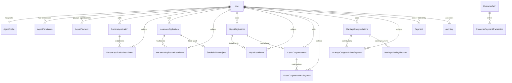
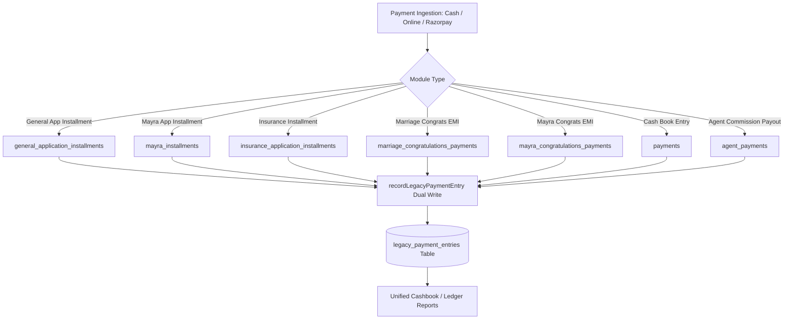
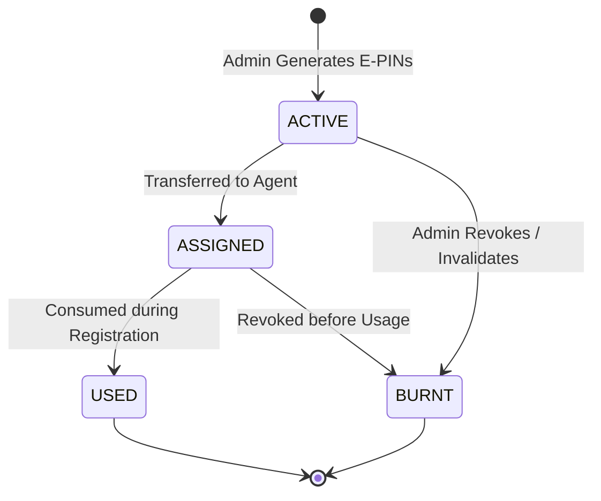
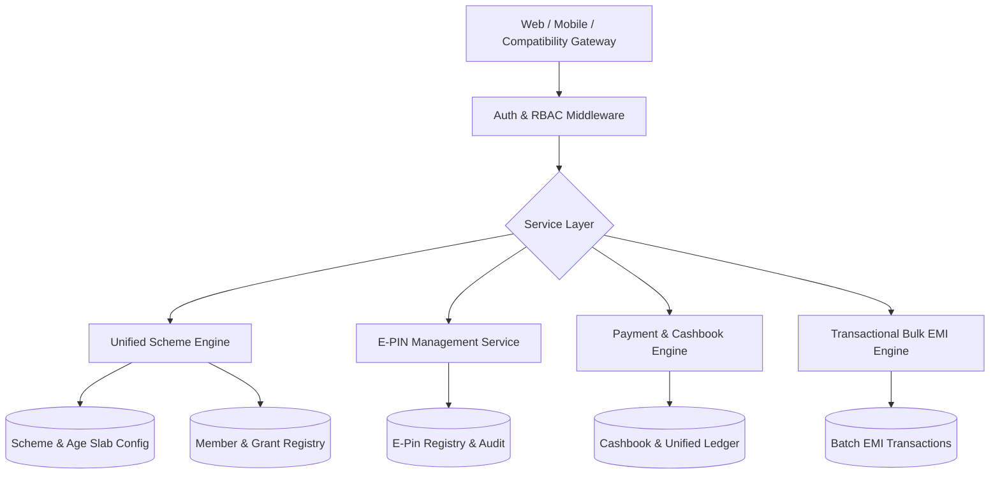

# SAF FOUNDATION – BACKEND ARCHITECTURE AUDIT REPORT
**Phase 1 – Read-Only Architecture Audit & Complete Mapping**
**Date:** 2026-08-30
**Application Name:** SAF Foundation (Purabiya Balika Foundation Backend)
**Contact:** 9950730637
**Audit Mode:** READ ONLY / NO DATABASE CHANGES / NO CODE MODIFICATION

---

## EXECUTIVE SUMMARY

This audit provides a comprehensive, rigorous mapping of the existing SAF Foundation backend codebase located at `purabiya-foundation-backend--main`. The backend is a production-oriented TypeScript / Node.js system running Express and Prisma ORM against a PostgreSQL database. It handles user/agent management, applicant registrations, congratulations (bonds/grants), installments, cashflow ledgers, and legacy API compatibility.

This report systematically details the existing architecture, models, routes, controllers, business rules, hardcoded values, pool mechanics, deduction rules, bulk processing risks, and identifies missing modules (including 5 required scheme types and the complete E-PIN lifecycle).

---

## 1. BACKEND TECHNOLOGY STACK

| Component | Technology / Library | Version | Purpose |
| :--- | :--- | :--- | :--- |
| **Runtime & Language** | Node.js / TypeScript | TypeScript 5.3.3, Node.js v20+ | Backend API Execution |
| **Web Framework** | Express.js | 4.18.3 | REST API Routing & Middleware |
| **ORM / Database Layer** | Prisma ORM / PostgreSQL | Prisma Client 5.22.0, CLI 5.10.0 | Relational Database Management |
| **Authentication & Tokens** | JSON Web Tokens (`jsonwebtoken`) & `bcryptjs` | JWT 9.0.2, bcryptjs 2.4.3 | Admin/Agent RBAC & Customer JWT |
| **Payment Gateway** | Razorpay Node SDK | 2.9.2 | Online Customer Payment Gateway |
| **Queue / Asynchronous Jobs** | BullMQ & ioredis | BullMQ 5.8.2, ioredis 5.3.2 | Redis-backed background queues (installed) |
| **Document Generation** | `pdf-lib`, `@pdf-lib/fontkit`, `@napi-rs/canvas` | pdf-lib 1.17.1, fontkit 1.1.1 | Dynamic PDF Form & Bond Generation |
| **Messaging & Notifications** | Axios / Green API (WhatsApp) | Axios 1.6.7 | Automated WhatsApp registration alerts |
| **Validation Layer** | Zod | 3.22.4 | Request payload schema validation |
| **File Uploads & Security** | Multer, Helmet, Cors, Cookie-Parser, Morgan | Helmet 7.1.0, Multer 1.4.5-lts.1 | File handling and HTTP security headers |

---

## 2. FOLDER / PROJECT STRUCTURE

```
purabiya-foundation-backend--main/
├── prisma/
│   ├── migrations/                     # Prisma migration history
│   │   └── 20260725_add_general_application_installment_index/
│   ├── schema.prisma                  # Complete DB schema (895 lines, 20 models, 5 enums)
│   ├── seed.ts                        # Database seeder script
│   └── tableConvert.com_deayne.json   # Seed data
├── src/
│   ├── app.ts                         # Express app bootstrap, CORS, middlewares, route mounts
│   ├── server.ts                      # HTTP listener & process lifecycle
│   ├── config/
│   │   └── db.ts                      # Prisma client instance & retry transaction options
│   ├── middlewares/
│   │   ├── auth.ts                    # JWT verification (Admin/Agent) & authorizeRoles middleware
│   │   ├── rbac.ts                    # Dynamic database-backed AgentPermission checker
│   │   └── validation.ts              # Zod schema request body validator
│   ├── utils/
│   │   ├── aadhar-uniqueness.ts       # Global uniqueness validator across all models
│   │   ├── associated-until.ts        # Hindi tenure/date text formatter
│   │   ├── compat-helpers.ts          # Legacy PHP data-shape mappers (29KB)
│   │   ├── errors.ts                  # AppError, BadRequestError, NotFoundError, UnauthorizedError
│   │   ├── file-upload.ts             # Base64 to disk image saver
│   │   ├── jwt.ts                     # Token generation and verification utilities
│   │   ├── legacy-payment-entry.ts    # Dual-write sync for unified cashflow ledger
│   │   ├── list-filters.ts            # Search, pagination, date ranges, form-seq pagination
│   │   ├── normalize.ts               # Value normalizers (gender, payment mode)
│   │   ├── parse-date.ts              # Robust multi-format date parser
│   │   ├── pdf.ts                     # PDF coordinate drawing helper
│   │   ├── sequence-lock.ts           # PostgreSQL advisory locks for race-free sequential IDs
│   │   ├── soft-delete.ts             # Recursive soft-delete cascading helper
│   │   └── whatsapp.ts                # Green API WhatsApp message dispatcher
│   └── modules/
│       ├── auth/                      # Admin & Agent login, token rotation
│       ├── agents/                    # Agent management, permissions, agent-wise report
│       ├── applications/              # General Marriage & Insurance Applications + Installments + Bima
│       ├── mayra/                     # Mayra Registration, Installments, Mayra Congratulations & EMI
│       ├── schemes/                   # Loans, Financial Help, Disability, Marriage Congrats, Pension, Camps
│       ├── payments/                  # Cashbook, Agent Commission Reports, Payouts, Razorpay
│       ├── documents/                 # PDF Bond & Registration generation endpoints
│       ├── dashboard/                 # Aggregate metric counters for Admin & Agent
│       ├── customer/                  # Customer OTP auth, profile, bulk payment orders, announcements
│       └── compatibility/             # Legacy PHP API monolithic gateway (168KB, ~80+ apicall actions)
└── uploads/                           # Static uploaded images & PDFs
```

---

## 3. API ROUTE MAP

### 3.1 V1 Modern REST API (`/api/v1`)

| Method | Endpoint | Handler / Controller | Middleware / Auth | Module |
| :--- | :--- | :--- | :--- | :--- |
| **POST** | `/api/v1/auth/login` | `AuthController.loginAdmin` | Public | Auth |
| **POST** | `/api/v1/auth/agent-login` | `AuthController.loginAgent` | Public | Auth |
| **POST** | `/api/v1/auth/refresh-token` | `AuthController.rotateTokens` | Public | Auth |
| **GET** | `/api/v1/agents` | `AgentsController.getAllAgents` | `authenticate` | Agents |
| **GET** | `/api/v1/agents/:id` | `AgentsController.getAgentById` | `authenticate` | Agents |
| **POST** | `/api/v1/agents` | `AgentsController.createAgent` | `authenticate`, `authorizeRoles("ADMIN")`, Zod | Agents |
| **PUT** | `/api/v1/agents/:id` | `AgentsController.updateAgent` | `authenticate`, Zod | Agents |
| **POST** | `/api/v1/agents/:id/toggle-status` | `AgentsController.toggleAgentStatus` | `authenticate`, `authorizeRoles("ADMIN")` | Agents |
| **DELETE**| `/api/v1/agents/:id` | `AgentsController.softDeleteAgent` | `authenticate`, `authorizeRoles("ADMIN")` | Agents |
| **GET** | `/api/v1/agents/:id/permissions` | `AgentsController.getAgentPermissions` | `authenticate` | Agents |
| **PUT** | `/api/v1/agents/:id/permissions` | `AgentsController.updateAgentPermissions` | `authenticate`, `authorizeRoles("ADMIN")`, Zod | Agents |
| **GET** | `/api/v1/applications/general` | `ApplicationsController.getAllGeneralApplications` | `authenticate`, `checkPermission("applicant_registration", "view")` | Applications |
| **GET** | `/api/v1/applications/general/:id` | `ApplicationsController.getGeneralApplicationById` | `authenticate`, `checkPermission("applicant_registration", "view")` | Applications |
| **POST** | `/api/v1/applications/general` | `ApplicationsController.createGeneralApplication` | `authenticate`, `checkPermission("applicant_registration", "create")`, Zod | Applications |
| **POST** | `/api/v1/applications/general/bulk-import` | `ApplicationsController.bulkImportGeneralApplications` | `authenticate`, `checkPermission("applicant_registration", "create")` | Applications |
| **PUT** | `/api/v1/applications/general/:id` | `ApplicationsController.updateGeneralApplication` | `authenticate`, `checkPermission("applicant_registration", "update")`, Zod | Applications |
| **DELETE**| `/api/v1/applications/general/:id` | `ApplicationsController.softDeleteGeneralApplication` | `authenticate`, `checkPermission("applicant_registration", "delete")` | Applications |
| **POST** | `/api/v1/applications/general/:id/installments` | `ApplicationsController.addGeneralInstallment` | `authenticate`, `checkPermission("applicant_registration", "create")`, Zod | Applications |
| **GET** | `/api/v1/applications/insurance` | `ApplicationsController.getAllInsuranceApplications` | `authenticate`, `checkPermission("suraksha_bima_yojana_payment", "view")` | Applications |
| **GET** | `/api/v1/applications/insurance/:id` | `ApplicationsController.getInsuranceApplicationById` | `authenticate`, `checkPermission("suraksha_bima_yojana_payment", "view")` | Applications |
| **POST** | `/api/v1/applications/insurance` | `ApplicationsController.createInsuranceApplication` | `authenticate`, `checkPermission("suraksha_bima_yojana_payment", "create")`, Zod | Applications |
| **DELETE**| `/api/v1/applications/insurance/:id` | `ApplicationsController.softDeleteInsuranceApplication` | `authenticate`, `checkPermission("suraksha_bima_yojana_payment", "delete")` | Applications |
| **POST** | `/api/v1/applications/insurance/:id/installments` | `ApplicationsController.addInsuranceInstallment` | `authenticate`, `checkPermission("suraksha_bima_yojana_payment", "create")`, Zod | Applications |
| **POST** | `/api/v1/applications/insurance/:id/suraksha-bima` | `ApplicationsController.createSurakshaBima` | `authenticate`, `checkPermission("suraksha_bima_yojana_payment", "create")`, Zod | Applications |
| **GET** | `/api/v1/applications/insurance/bulk/data` | `ApplicationsController.getInsuranceBulkData` | `authenticate`, `checkPermission("suraksha_bima_yojana_payment", "view")` | Applications |
| **POST** | `/api/v1/applications/insurance/bulk/payments` | `ApplicationsController.updateBimaPaymentStatus` | `authenticate`, `checkPermission("suraksha_bima_yojana_payment", "create")` | Applications |
| **POST** | `/api/v1/applications/insurance/bulk/pdf-status` | `ApplicationsController.updateInsurancePdfStatus` | `authenticate`, `checkPermission("suraksha_bima_yojana_payment", "create")` | Applications |
| **GET** | `/api/v1/mayra` | `MayraController.getAllMayraRegistrations` | `authenticate`, `checkPermission("mayra_registration", "view")` | Mayra |
| **GET** | `/api/v1/mayra/:id` | `MayraController.getMayraRegistrationById` | `authenticate`, `checkPermission("mayra_registration", "view")` | Mayra |
| **POST** | `/api/v1/mayra` | `MayraController.createMayraRegistration` | `authenticate`, `checkPermission("mayra_registration", "create")`, Zod | Mayra |
| **PUT** | `/api/v1/mayra/:id` | `MayraController.updateMayraRegistration` | `authenticate`, `checkPermission("mayra_registration", "update")` | Mayra |
| **DELETE**| `/api/v1/mayra/:id` | `MayraController.softDeleteMayraRegistration` | `authenticate`, `checkPermission("mayra_registration", "delete")` | Mayra |
| **POST** | `/api/v1/mayra/:id/installments` | `MayraController.addMayraInstallment` | `authenticate`, `checkPermission("mayra_registration", "create")`, Zod | Mayra |
| **POST** | `/api/v1/mayra/:id/congratulations` | `MayraController.createMayraCongratulations` | `authenticate`, `checkPermission("mayra_registration", "create")`, Zod | Mayra |
| **POST** | `/api/v1/mayra/congratulations/:id/payments` | `MayraController.addMayraCongratulationsPayment` | `authenticate`, `checkPermission("mayra_registration", "create")`, Zod | Mayra |
| **GET** | `/api/v1/mayra/:id/members` | `MayraController.getMayraCongratulationsMembers` | `authenticate`, `checkPermission("mayra_registration", "view")` | Mayra |
| **GET** | `/api/v1/mayra/:id/payments` | `MayraController.getMayraCongratulationsPayments` | `authenticate`, `checkPermission("mayra_registration", "view")` | Mayra |
| **DELETE**| `/api/v1/mayra/congratulations/payments/:paymentId` | `MayraController.deleteMayraCongratulationsPayment` | `authenticate`, `checkPermission("mayra_registration", "delete")` | Mayra |
| **GET** | `/api/v1/mayra/:id/congratulations/details` | `MayraController.getMayraCongratulationsDetails` | `authenticate`, `checkPermission("mayra_registration", "view")` | Mayra |
| **GET** | `/api/v1/mayra/bulk/data` | `MayraController.getMayraBulkData` | `authenticate`, `checkPermission("mayra_registration", "view")` | Mayra |
| **POST** | `/api/v1/mayra/bulk/payments` | `MayraController.updateMayraBulkPayments` | `authenticate`, `checkPermission("mayra_registration", "create")` | Mayra |
| **POST** | `/api/v1/mayra/bulk/pdf-status` | `MayraController.updateMayraPdfStatus` | `authenticate`, `checkPermission("mayra_registration", "create")` | Mayra |
| **POST** | `/api/v1/schemes/marriage-congratulations` | `SchemesController.createMarriageCongratulations` | `authenticate`, `checkPermission("marriage_congratulations_payment", "create")`, Zod | Schemes |
| **GET** | `/api/v1/schemes/marriage-congratulations` | `SchemesController.getAllMarriageCongratulations` | `authenticate`, `checkPermission("marriage_congratulations_payment", "view")` | Schemes |
| **GET** | `/api/v1/schemes/marriage-congratulations/:id` | `SchemesController.getMarriageCongratulationsById` | `authenticate`, `checkPermission("marriage_congratulations_payment", "view")` | Schemes |
| **POST** | `/api/v1/schemes/marriage-congratulations/:id/payments` | `SchemesController.addMarriageCongratulationsPayment` | `authenticate`, `checkPermission("marriage_congratulations_payment", "create")`, Zod | Schemes |
| **POST** | `/api/v1/schemes/marriage-congratulations/:id/sewing-machines` | `SchemesController.addMarriageSewingMachine` | `authenticate`, `checkPermission("marriage_congratulations_payment", "create")`, Zod | Schemes (To Disable) |
| **GET** | `/api/v1/schemes/marriage-congratulations/:id/members` | `SchemesController.getMarriageCongratulationsMembers` | `authenticate`, `checkPermission("marriage_congratulations_payment", "view")` | Schemes |
| **GET** | `/api/v1/schemes/marriage-congratulations/:id/payments` | `SchemesController.getMarriageCongratulationsPayments` | `authenticate`, `checkPermission("marriage_congratulations_payment", "view")` | Schemes |
| **DELETE**| `/api/v1/schemes/marriage-congratulations/payments/:paymentId` | `SchemesController.deleteMarriageCongratulationsPayment` | `authenticate`, `checkPermission("marriage_congratulations_payment", "delete")` | Schemes |
| **GET** | `/api/v1/schemes/marriage-congratulations/:id/details` | `SchemesController.getMarriageCongratulationsDetails` | `authenticate`, `checkPermission("marriage_congratulations_payment", "view")` | Schemes |
| **GET** | `/api/v1/schemes/marriage-congratulations/bulk/data` | `SchemesController.getMarriageCongratulationsBulkData` | `authenticate`, `checkPermission("marriage_congratulations_payment", "view")` | Schemes |
| **POST** | `/api/v1/schemes/marriage-congratulations/bulk/payments` | `SchemesController.updateMarriageCongratulationsBulkPayments` | `authenticate`, `checkPermission("marriage_congratulations_payment", "create")` | Schemes |
| **POST** | `/api/v1/schemes/marriage-congratulations/bulk/pdf-status` | `SchemesController.updateMarriageCongratulationsPdfStatus` | `authenticate`, `checkPermission("marriage_congratulations_payment", "create")` | Schemes |
| **POST** | `/api/v1/schemes/loans` | `SchemesController.createLoan` | `authenticate`, `checkPermission("applicant_registration", "create")` | Schemes (To Disable) |
| **GET** | `/api/v1/schemes/loans` | `SchemesController.getAllLoans` | `authenticate`, `checkPermission("applicant_registration", "view")` | Schemes (To Disable) |
| **GET** | `/api/v1/schemes/loans/:id` | `SchemesController.getLoanById` | `authenticate`, `checkPermission("applicant_registration", "view")` | Schemes (To Disable) |
| **POST** | `/api/v1/schemes/loans/:id/installments` | `SchemesController.addLoanInstallment` | `authenticate`, `checkPermission("applicant_registration", "create")` | Schemes (To Disable) |
| **POST** | `/api/v1/schemes/financial-help` | `SchemesController.createFinancialHelp` | `authenticate`, `checkPermission("payment_management", "create")` | Schemes |
| **GET** | `/api/v1/schemes/financial-help` | `SchemesController.getAllFinancialHelps` | `authenticate`, `checkPermission("payment_management", "view")` | Schemes |
| **POST** | `/api/v1/schemes/disability-cycles` | `SchemesController.createDisabilityCycle` | `authenticate`, `checkPermission("applicant_registration", "create")` | Schemes (To Disable) |
| **GET** | `/api/v1/schemes/disability-cycles` | `SchemesController.getAllDisabilityCycles` | `authenticate`, `checkPermission("applicant_registration", "view")` | Schemes (To Disable) |
| **POST** | `/api/v1/schemes/pension` | `SchemesController.createPensionYojana` | `authenticate`, `checkPermission("payment_management", "create")` | Schemes (To Disable) |
| **GET** | `/api/v1/schemes/pension` | `SchemesController.getAllPensionYojanas` | `authenticate`, `checkPermission("payment_management", "view")` | Schemes (To Disable) |
| **GET** | `/api/v1/schemes/pension/:id` | `SchemesController.getPensionYojanaById` | `authenticate`, `checkPermission("payment_management", "view")` | Schemes (To Disable) |
| **POST** | `/api/v1/schemes/pension/:id/payments` | `SchemesController.addPensionPayment` | `authenticate`, `checkPermission("payment_management", "create")` | Schemes (To Disable) |
| **POST** | `/api/v1/schemes/sewing-camps` | `SchemesController.createSewingMachineCamp` | `authenticate`, `checkPermission("applicant_registration", "create")` | Schemes (To Disable) |
| **GET** | `/api/v1/schemes/sewing-camps` | `SchemesController.getAllSewingMachineCamps` | `authenticate`, `checkPermission("applicant_registration", "view")` | Schemes (To Disable) |
| **POST** | `/api/v1/payments` | `PaymentsController.createPayment` | `authenticate`, `checkPermission("payment_management", "create")` | Payments |
| **GET** | `/api/v1/payments` | `PaymentsController.getAllPayments` | `authenticate`, `checkPermission("payment_management", "view")` | Payments |
| **GET** | `/api/v1/payments/commission/report` | `PaymentsController.getAgentCommissionReport` | `authenticate`, `checkPermission("payment_management", "view")` | Payments |
| **POST** | `/api/v1/payments/commission/payout` | `PaymentsController.payAgentCommission` | `authenticate`, `authorizeRoles("ADMIN")` | Payments |
| **POST** | `/api/v1/payments/razorpay/create-order`| `PaymentsController.createRazorpayOrder` | `authenticate`, Zod | Payments |
| **POST** | `/api/v1/payments/razorpay/verify-payment`| `PaymentsController.verifyRazorpayPayment` | `authenticate`, Zod | Payments |
| **GET** | `/api/v1/dashboard/counts` | `DashboardController.getCounts` | `authenticate` | Dashboard |
| **GET** | `/api/v1/documents/general-application/:id/pdf` | `DocumentsController.downloadGeneralApplicationPDF` | `authenticate` | Documents |
| **GET** | `/api/v1/documents/mayra-application/:id/pdf` | `DocumentsController.downloadMayraApplicationPDF` | `authenticate` | Documents |
| **GET** | `/api/v1/documents/bond/:id/pdf` | `DocumentsController.downloadBondPDF` | `authenticate` | Documents |

### 3.2 Compatibility API (`/api` and `/api/api.php`)
Dispatches on `?apicall=` or `body.apicall` (Handles legacy mobile/web clients):
- Auth: `login`, `agentLogin`, `logout`
- Slabs: `calculateMayraFees`
- Dashboard & Permissions: `getDashboardCounts`, `getAgentPermissions`, `setAgentPermissions`
- General Applications: `createApplication`, `getApplications`, `updateApplication`, `deleteApplication`, `updateApplicationActiveStatus`
- Insurance: `createInsuranceApplication`, `getInsuranceApplication`, `editInsuranceApplication`, `deleteInsuranceApplication`, `updateInsuranceApplicationActiveStatus`, `getApplicationInsuranceInstallments`, `addApplicationInsuranceInstallment`, `getSurakshaBima`, `addSurakshaBima`, `getSurakshaBimaBulkData`, `updateBimaPaymentStatus`
- Mayra: `createMayraRegistration`, `getMayraRegistration`, `updateMayraRegistration`, `deleteMayraRegistration`, `addMayraInstallment`, `getMayraInstallments`, `addMayraCongrats`, `getMayraCongratulations`, `getMayraBulkData`, `updateMayraBulkPayments`
- Marriage Congratulations: `addMarriageCongrats`, `getMarriageCongrats`, `getMarriageCongratulations`, `getPreviousApplicationsMembers`, `createMarriageCongratulationsPayment`, `getMarriageCongratulationsInstallments`, `addMarriageCongratulationsInstallment`, `deleteMarriageCongratulationsPayment`, `getMarriageCongratulationsBulkData`, `updateMarriageCongratulationsBulkPayments`
- Agents: `addAgent`, `getAgents`, `getAgentWiseReport`, `editAgent`, `deleteAgent`, `addAgentPaymentForDetails`, `getAgentPaymentsForDetails`
- Payments & Cash Flow: `getPaymentList`, `addPayment`, `deletePayment`, `getAgentCommissionReport`
- Disabled schemes: `addLoanApplication`, `getLoanApplications`, `addLoanApplicationInstallment`, `addDisabilityCycle`, `getDisabilityCycles`, `addFinancialHelp`, `getFinancialHelps`, `addFinancialHelpInstallment`, `addPensionYojana`, `getPensionYojanas`, `addPensionPayment`, `addSewingCamp`, `getSewingCamps`, `addMarriageSewing`, `getMarriageSewing`

### 3.3 Customer API (`/api/customer` and `/api/customer_api.php`)
Dispatches on `?apicall=`:
- OTP & Auth: `customerRequestOtp`, `customerVerifyOtp`, `customerCreatePassword`, `customerLogin`, `customerProfile`, `customerLogout`
- Lookups: `getAllApplicationsByMobile`, `getUserBulkData`, `getAllModuleMemberCounts`
- Customer Online Payment: `createPaymentOrder`, `verifyPaymentTransaction`, `getPaymentTransactionHistory`
- Announcements: `getLatestAnnouncements`, `getAnnouncementDetails`

---

## 4. CONTROLLER MAP

| Controller Class | File Location | Key Responsibilities |
| :--- | :--- | :--- |
| `AuthController` | `src/modules/auth/auth.controller.ts` | Handles Admin/Agent login HTTP requests and JWT cookie/token responses. |
| `AgentsController` | `src/modules/agents/agents.controller.ts` | Agent CRUD, permission updates, status toggles, agent-wise performance reports. |
| `ApplicationsController` | `src/modules/applications/applications.controller.ts` | General & Insurance registration endpoints, installments, Suraksha Bima creation, Bulk Bima processing. |
| `MayraController` | `src/modules/mayra/mayra.controller.ts` | Mayra registrations, age slab validations, Mayra Congratulations bonds, bulk Mayra EMI mapping and execution. |
| `SchemesController` | `src/modules/schemes/schemes.controller.ts` | Marriage Congratulations creation & payouts, bulk Marriage EMI, plus legacy loans, disability, pension, camps. |
| `PaymentsController` | `src/modules/payments/payments.controller.ts` | Cashbook ledger entries, Agent Commission calculations & payouts, Razorpay order creation and signature verification. |
| `DashboardController` | `src/modules/dashboard/dashboard.controller.ts` | Real-time counter metrics for Admin/Agent dashboards. |
| `DocumentsController` | `src/modules/documents/documents.controller.ts` | Streaming downloadable PDF forms and membership grant bonds. |

---

## 5. SERVICE MAP

| Service Class | File Location | Core Business Logic |
| :--- | :--- | :--- |
| `AuthService` | `src/modules/auth/auth.service.ts` | Password hashing/verification with bcrypt, access/refresh token generation and rotation. |
| `AgentsService` | `src/modules/agents/agents.service.ts` | Agent profile creation with auto-generated `EMP-###` IDs, default permissions provisioning, recursive cascading soft-deletion, date-range categorized performance aggregation. |
| `ApplicationsService` | `src/modules/applications/applications.service.ts` | Form sequence generation (`F-###`, `M-###`, `SB-###`), Aadhaar uniqueness enforcement, initial installment recording, Green API WhatsApp dispatch, lateral-join installment optimization. |
| `MayraService` | `src/modules/mayra/mayra.service.ts` | Mayra registration (`MYR-###`), dynamic `SchemeAgeSlab` fee matching, congratulations bond creation, WhatsApp dispatch, contribution payout records. |
| `SchemesService` | `src/modules/schemes/schemes.service.ts` | Marriage congratulations sequence (`MC-F-###` / `MC-M-###`), pool count snapshotting (`computeMarriagePoolCounts`), beneficiary deactivation (`isActive: false`), member contribution lookup. |
| `PaymentsService` | `src/modules/payments/payments.service.ts` | Dual-entry cashbook ledger management, raw SQL unified cashflow querying, cross-module agent commission reconciliation, Razorpay order/signature verification. |
| `CustomerService` | `src/modules/customer/customer.service.ts` | Customer OTP lifecycle (6-digit, 10 min expiry), cross-module application search by mobile, Razorpay order generation & verification for customer portal. |
| `DashboardService` | `src/modules/dashboard/dashboard.service.ts` | Admin vs Agent-scoped aggregate counting across all 12 modules + 7-day registration velocity. |
| `DocumentsService` | `src/modules/documents/documents.service.ts` | PDF layout compilation using templates or programmatic Canvas/Fontkit rendering. |

---

## 6. PRISMA / DATABASE MODEL MAP



### Complete Model Inventory (20 Models, 5 Enums)

1. `User`: Core authentication entity (Roles: `ADMIN`, `AGENT`).
2. `AgentProfile`: 1-to-1 extended agent demographics, employee ID, banking details, gotra, nominee.
3. `AgentPermission`: Fine-grained module permissions (`module`, `canView`, `canCreate`, `canUpdate`, `canDelete`).
4. `GeneralApplication`: Core general marriage member registry (gender-separated pools `M-###` / `F-###`, category `A-E`, `totalAmount`, `pendingAmount`, `isActive`).
5. `GeneralApplicationInstallment`: Cash/online installments collected against `GeneralApplication`.
6. `InsuranceApplication`: Bima membership registry (`srNo`, `formNumber`, `totalAmount`, `pendingAmount`).
7. `InsuranceApplicationInstallment`: Installments & Bima EMI contributions (`BIMA_PAYMENT:...`).
8. `SurakshaBimaYojana`: Bima grant record (`bimaNumber`, `rate200` member count, `deducted10Percent`, `deducted25Percent`, `totalPaidAmount`).
9. `MayraRegistration`: Mayra member registry (`MYR-###`, `age`, `slabCode`, `joiningFee`, `mayraInstallment`).
10. `MayraInstallment`: Installments collected against `MayraRegistration`.
11. `MayraCongratulations`: Mayra grant record (`mayraNumber`, `rate200`, `rate300` member counts, `deductionPercent`, `deductedAmount`, `totalPaidAmount`).
12. `MayraCongratulationsPayment`: Member EMI contributions toward a Mayra congratulations event.
13. `MarriageCongratulations`: Marriage grant record (`marriageNumber`, `codeNumber`, `rate100`, `rate200`, `rate300` member counts, `deductionPercent`, `totalPaidAmount`).
14. `MarriageCongratulationsPayment`: Member EMI contributions toward a Marriage congratulations event.
15. `MarriageSewingMachine`: *[To Disable]* Sewing machine distribution tied to marriage congratulations.
16. `SewingMachineCamp`: *[To Disable]* Independent sewing machine camp applications.
17. `DisabilityCycle`: *[To Disable]* Disability tricycle applications.
18. `PensionYojana` & `PensionYojanaPayment`: *[To Disable]* Monthly pension scheme and disbursements.
19. `LoanApplication` & `LoanApplicationInstallment`: *[To Disable]* Loan applications and repayment tracking.
20. `Payment`: Manual cash flow / cash book ledger entries (`In` / `Out`).
21. `AgentPayment`: Commission payout records to agents.
22. `LegacyPaymentEntry`: Unified cash flow mirror table for financial reporting.
23. `CustomerAuth`: Customer portal OTP/password credentials.
24. `CustomerPaymentTransaction`: Razorpay online transaction logs.
25. `Announcement`: System-wide announcements by application type.
26. `SchemeAgeSlab`: Database-backed age slab rules (`schemeType`, `slabCode`, `minAge`, `maxAge`, `joiningFee`, `installment`).
27. `AuditLog`: System audit trail.

---

## 7. AUTHENTICATION SYSTEM

- **Admin & Agent Authentication**:
  - Uses `bcryptjs` for comparing passwords against `User.passwordHash`.
  - Generates HMAC-SHA256 JWT tokens using `process.env.JWT_SECRET` (default expiry 1 day) and Refresh Tokens using `process.env.JWT_REFRESH_SECRET` (default expiry 7 days).
  - Authenticated via `Authorization: Bearer <token>` header or `accessToken` cookie.
- **Customer Authentication**:
  - OTP-based login via 6-digit random code stored in `CustomerAuth.otpCode` (expires in 10 minutes).
  - Password creation and password login with dedicated customer JWT (`verifyCustomerAccessToken`).
- **Compatibility Gateway Authentication**:
  - Handles legacy token authentication inline inside `compatibility.routes.ts`. Returns HTTP 200 with `{ error: true, message: "Unauthorized" }` for backward compatibility with older Android/Web clients.

---

## 8. AUTHORIZATION & RBAC SYSTEM

- **Role Levels**:
  - `Role.ADMIN`: Bypasses all module-level permission checks (`rbac.ts` returns `next()` immediately).
  - `Role.AGENT`: Restricted to explicit permissions assigned in `AgentPermission` table.
- **Enforcement Middleware**:
  - `authorizeRoles("ADMIN")`: Blocks non-admins from sensitive operations (agent creation, payouts, status toggling).
  - `checkPermission(moduleName, action)`: Validates agent's `canView`, `canCreate`, `canUpdate`, or `canDelete` flags for the specific module.

---

## 9. PERMISSION SYSTEM

Default modules configured upon agent registration:
1. `dashboard` (view: true)
2. `agent_registration` (view: true, create: true, update: true)
3. `applicant_registration` (view: true, create: true, update: true)
4. `mayra_registration` (view: true, create: true, update: true)
5. `payment_management` (view: true)
6. `marriage_congratulations_payment` (view: true)
7. `suraksha_bima_yojana_payment` (view: true)
8. `bulk_marriage_emi` (view: true)
9. `bulk_suraksha_bima_emi` (view: true)
10. `bulk_mayra_emi` (view: true)

---

## 10. EXISTING MODULES STATUS

| Module | Status in Codebase | Route Exposure | DB Models Present |
| :--- | :--- | :--- | :--- |
| **Auth & Profile** | Active / Fully Functional | `/api/v1/auth`, `/api` | `User`, `AgentProfile`, `AgentPermission` |
| **General Marriage Applications** | Active / Production | `/api/v1/applications/general`, `/api` | `GeneralApplication`, `GeneralApplicationInstallment` |
| **Marriage Congratulations** | Active / Production | `/api/v1/schemes/marriage-congratulations`, `/api` | `MarriageCongratulations`, `MarriageCongratulationsPayment` |
| **Mayra Scheme** | Active / Production | `/api/v1/mayra`, `/api` | `MayraRegistration`, `MayraInstallment`, `MayraCongratulations`, `MayraCongratulationsPayment` |
| **Insurance / Suraksha Bima** | Active / Production | `/api/v1/applications/insurance`, `/api` | `InsuranceApplication`, `InsuranceApplicationInstallment`, `SurakshaBimaYojana` |
| **Agent Management & Reports** | Active / Production | `/api/v1/agents`, `/api/v1/payments/commission`, `/api` | `User`, `AgentProfile`, `AgentPermission`, `AgentPayment` |
| **Cashbook & Unified Ledger** | Active / Production | `/api/v1/payments`, `/api` | `Payment`, `LegacyPaymentEntry` |
| **Customer Portal** | Active / Functional | `/api/customer` | `CustomerAuth`, `CustomerPaymentTransaction`, `Announcement` |
| **Age Slab Configuration** | Partially Active (Mayra only) | Internal query in `MayraService` | `SchemeAgeSlab` |
| **Marriage Sewing Machines** | Active (Needs Disable) | `/api/v1/schemes/.../sewing-machines`, `/api` | `MarriageSewingMachine` |
| **Sewing Machine Camps** | Active (Needs Disable) | `/api/v1/schemes/sewing-camps`, `/api` | `SewingMachineCamp` |
| **Disability Cycles** | Active (Needs Disable) | `/api/v1/schemes/disability-cycles`, `/api` | `DisabilityCycle` |
| **Pension Yojana** | Active (Needs Disable) | `/api/v1/schemes/pension`, `/api` | `PensionYojana`, `PensionYojanaPayment` |
| **Loans** | Active (Needs Disable) | `/api/v1/schemes/loans`, `/api` | `LoanApplication`, `LoanApplicationInstallment` |

---

## 11. REQUIRED MODULES MAPPING

| Required Business Module | Current Implementation Status | Mapping / Strategy Required |
| :--- | :--- | :--- |
| **1. General Marriage Application + Congratulation Payment** | **Implemented** | Maps to `GeneralApplication` & `MarriageCongratulations`. Needs age slab dynamic integration. |
| **2. Mayra General Application + Congratulation Payment** | **Implemented** | Maps to `MayraRegistration` & `MayraCongratulations`. Age slabs active in Mayra. |
| **3. Insurance Bima Application + Bima Payment** | **Implemented** | Maps to `InsuranceApplication` & `SurakshaBimaYojana`. |
| **4. Janni Delivery Registration + Payment** | **MISSING** | Needs scheme model, registration table, grant table, and routes. |
| **5. Aawas(Home) Registration + Payment** | **MISSING** | Needs scheme model, registration table, grant table, and routes. |
| **6. Lado Bahin Registration + Payment** | **MISSING** | Needs scheme model, registration table, grant table, and routes. |
| **7. Dhundhotsav Registration + Payment** | **MISSING** | Needs scheme model, registration table, grant table, and routes. |
| **8. ShubhLaxmi(Deepawali) Registration + Payment** | **MISSING** | Needs scheme model, registration table, grant table, and routes. |
| **9. Agent Registration & Permissions** | **Implemented** | Maps to `User` + `AgentProfile` + `AgentPermission`. |
| **10. Agent Commission Payment** | **Implemented** | Maps to `AgentPayment` + `PaymentsService.payAgentCommission`. |
| **11. Agent Commission Report** | **Implemented** | Maps to `PaymentsService.getAgentCommissionReport`. |
| **12. Agent Wise Report** | **Implemented** | Maps to `AgentsService.getAgentRecordsReport`. |
| **13. Bulk Marriage EMI** | **Implemented** | Maps to `SchemesController.updateMarriageCongratulationsBulkPayments`. |
| **14. Bulk Mayra EMI** | **Implemented** | Maps to `MayraController.updateMayraBulkPayments`. |
| **15. Bulk Insurance Bima EMI** | **Implemented** | Maps to `ApplicationsController.updateBimaPaymentStatus`. |
| **16. Payment Management** | **Implemented** | Maps to `Payment`, `LegacyPaymentEntry`, and Razorpay services. |

---

## 12. DISABLED MODULES MAPPING & SAFE DISABLE STRATEGY

### Target Modules to Disable (DO NOT DELETE DATA):
1. **Marriage Sewing Machine Distribution Applications**
   - Tables: `marriage_sewing_machines`
   - Files: `src/modules/schemes/schemes.service.ts` (lines 1042–1093), `src/modules/schemes/schemes.controller.ts` (lines 201–215), `src/modules/compatibility/compatibility.routes.ts` (`addMarriageSewing`, `getMarriageSewing`).
2. **Sewing Machine Camp**
   - Tables: `sewing_machine_camps`
   - Files: `src/modules/schemes/schemes.service.ts` (lines 1420–1458), `src/modules/schemes/schemes.controller.ts` (lines 265–282), `compatibility.routes.ts` (`addSewingCamp`, `getSewingCamps`).
3. **Disability Cycle Distribution**
   - Tables: `disability_cycles`
   - Files: `src/modules/schemes/schemes.service.ts` (lines 760–810), `src/modules/schemes/schemes.controller.ts` (lines 80–100), `compatibility.routes.ts` (`addDisabilityCycle`, `getDisabilityCycles`).
4. **Pension Yojana Application Payment**
   - Tables: `pension_yojana`, `pension_yojana_payments`
   - Files: `src/modules/schemes/schemes.service.ts` (lines 1096–1150), `src/modules/schemes/schemes.controller.ts` (lines 217–263), `compatibility.routes.ts` (`addPensionYojana`, `getPensionYojanas`, `addPensionPayment`).
5. **Loan Application List**
   - Tables: `loan_applications`, `loan_application_installments`
   - Files: `src/modules/schemes/schemes.service.ts` (lines 280–340), `src/modules/schemes/schemes.controller.ts` (lines 20–78), `compatibility.routes.ts` (`addLoanApplication`, `getLoanApplications`, `addLoanApplicationInstallment`).

### Safe Disable Strategy (Zero Data Loss):
1. **Database Level**: Keep all tables, columns, indexes, and existing data completely intact. Do not drop tables or delete rows.
2. **Route Level**: Attach a `disabledModuleGuard` middleware returning HTTP 403 / JSON `{ success: false, disabled: true, message: "This module has been decommissioned." }`.
3. **Default Permissions**: Remove the 5 modules from the default permission array assigned to newly created agents in `AgentsService.createAgent`.
4. **Dashboard Aggregates**: Exclude disabled modules from `DashboardService.getCounts` or return static zero without querying the tables.
5. **Customer Multi-Module Query**: Filter out disabled scheme results from `CustomerService.getAllApplicationsByMobile`.

---

## 13. PAYMENT ARCHITECTURE

### Current Dual-Entry Pattern
When an installment or grant payment is created across any operational table:
1. Operational record is written to its dedicated table (`general_application_installments`, `mayra_installments`, `marriage_congratulations_payments`, etc.).
2. A duplicate normalized entry is inserted into `legacy_payment_entries` via `recordLegacyPaymentEntry(tx, { legacyId, date, amount, name, source, type })`.
3. Financial queries (`getUnifiedPaymentList`) execute raw PostgreSQL aggregation against `legacy_payment_entries`.

### Payment Flow Breakdown


### Protection Against Duplicate Payments
- **Current State**: `MarriageCongratulations` creation uses Serializable transaction isolation and checks `codeNumber` uniqueness to prevent duplicate grant issuance.
- **Gap Identified**: Bulk EMI payment endpoints loop over items and execute individual inserts without idempotency keys, unique constraint locks, or batch-level transactions.

---

## 14. COMMISSION ARCHITECTURE

### Commission Audit & Calculations
- **Location**: `src/modules/payments/payments.service.ts` (`getAgentCommissionReport`, lines 162–668).
- **Structure**:
  - Gathers all member registrations and installment collections attributed to `addedById === agentId` within the specified date range.
  - Formats 15 distinct record types into a unified structure for commission evaluation.
  - Avoids double-counting: Ignores `totalAmount` on registrations (which represents target fee) and counts only actual collected cash rows (`Registration Fee` vs `EMI`).
  - Separates own-member fees from cross-member EMI contributions (`BIMA_PAYMENT:` and `MARRIAGE_CONGRATS_EMI:`).
- **Payout Tracking**:
  - Commission payouts recorded in `agent_payments` table (`agentId`, `amount`, `startDate`, `endDate`, `paymentDate`, `addedById`).
  - Payout entry automatically logged as an `"Out"` cash flow in `legacy_payment_entries`.

---

## 15. EMI ARCHITECTURE

### Comparison of EMI Implementations

| Feature | Marriage Bulk EMI | Mayra Bulk EMI | Insurance Bulk EMI |
| :--- | :--- | :--- | :--- |
| **Payer Source Table** | `GeneralApplication` | `GeneralApplication` (cross-scheme) | `InsuranceApplication` |
| **Recipient Table** | `MarriageCongratulations` | `MayraCongratulations` | `SurakshaBimaYojana` |
| **Installment Storage Table** | `marriage_congratulations_payments` | `mayra_congratulations_payments` | `insurance_application_installments` (tagged note) |
| **Per-Member EMI Rule** | Category A: ₹100, B: ₹200, C: ₹300 | Category B: ₹200, C: ₹300 (Cat A = ₹0) | Flat ₹200 (`SURAKSHA_BIMA_EMI_AMOUNT`) |
| **Batch Transaction Safety** | ❌ None (individual loops) | ❌ None (individual loops) | ❌ None (individual loops) |
| **Failure Recovery** | Partial counter (`updated`, `failed`) | Partial counter (`updated`, `failed`) | Partial counter (`updated`, `failed`) |

---

## 16. E-PIN ARCHITECTURE (AUDIT & PROPOSED LIFECYCLE)

### Current Audit Findings
- **Status in Codebase**: **0% IMPLEMENTED / COMPLETELY MISSING**.
- No `EPin` model in `schema.prisma`.
- No database tables, no state machine, no controllers, no generation, assignment, usage, or burn logic.

### Required Lifecycle & State Machine


### Proposed E-PIN Database Design (Plan Only)
```prisma
enum EPinStatus {
  ACTIVE
  ASSIGNED
  USED
  BURNT
}

model EPin {
  id              String      @id @default(uuid()) @db.Uuid
  pinCode         String      @unique @db.VarChar(50)
  schemeType      String      @db.VarChar(50)
  slabCode        String?     @db.VarChar(50)
  amount          Decimal     @db.Decimal(10, 2)
  status          EPinStatus  @default(ACTIVE)
  generatedById   String      @db.Uuid
  assignedToId    String?     @db.Uuid
  assignedAt      DateTime?
  usedById        String?     @db.Uuid
  usedAt          DateTime?
  usedInModule    String?     @db.VarChar(50)
  usedEntityId    String?     @db.Uuid
  burntById       String?     @db.Uuid
  burntAt         DateTime?
  burnReason      String?
  createdAt       DateTime    @default(now())
  updatedAt       DateTime    @updatedAt
}
```

---

## 17. SCHEME ARCHITECTURE

### Scheme Types Overview
The business operates under tiered scheme types:
- ₹300 Scheme
- ₹500 Scheme
- ₹1,000 Scheme
- ₹1,500 Scheme

### Current Scheme Modeling in DB
- Schemes are currently hardcoded as separate application models: `GeneralApplication`, `MayraRegistration`, `InsuranceApplication`.
- The required 5 additional schemes (Janni, Aawas, Lado Bahin, Dhundhotsav, ShubhLaxmi) do not exist as models or dynamic records.
- **Architectural Recommendation**: Establish a database-driven `SchemeDefinition` and `SchemeAgeSlab` configuration system that allows all schemes to share a unified core engine while maintaining distinct scheme identity and reporting.

---

## 18. AGE SLAB ARCHITECTURE

### Required A–F Age Slab Table
| Slab Code | Age Range | Joining / Registration Fee | Current Hardcoded State |
| :---: | :---: | :---: | :--- |
| **A** | 1–5 years | ₹1,500 | Not in DB / Hardcoded in client |
| **B** | 6–10 years | ₹3,100 | Not in DB / Hardcoded in client |
| **C** | 11–15 years | ₹5,100 | Partial in Mayra (`minAge: 10, joiningFee: 6000`) |
| **D** | 16–18 years | ₹8,100 | Partial in Mayra (`minAge: 16, joiningFee: 9000`) |
| **E** | 19–21 years | ₹10,000 | Partial in Mayra (`minAge: 19, joiningFee: 11000`) |
| **F** | 22+ years | ₹11,000 | Missing in `ApplicationCategory` enum! |

### Audit Findings on Age Calculations
- `MayraService.createMayraRegistration` dynamically matches age against `SchemeAgeSlab` where `schemeType == 'MAYRA'`.
- `GeneralApplication` relies entirely on a client-submitted `category` (`A`, `B`, `C`, `D`, `E`) without age-to-fee verification.
- `ApplicationCategory` enum in `schema.prisma` contains only `A, B, C, D, E` — **Category F is missing from the enum definition**.

---

## 19. POOL ARCHITECTURE (MALE / FEMALE)

### Pool Segregation Rules
- **General Applications**:
  - Independent form sequences: Female (`F-001`, `F-002`, ...), Male (`M-001`, `M-002`, ...).
  - Maintained via atomic advisory locks: `general_application_form_number:F` and `general_application_form_number:M`.
- **Marriage Congratulations Grant Pool**:
  - When a Female marriage congratulation occurs, `computeMarriagePoolCounts` counts **only active female members** registered on or before the marriage date.
  - When a Male marriage congratulation occurs, it counts **only active male members**.
  - Upon congratulations creation, the applicant's own `GeneralApplication` is deactivated (`isActive: false`) to permanently remove them from future EMI payer pools.
- **Mayra Congratulations Pool**:
  - Currently evaluates all active members regardless of gender, but filters categories B and C for EMI collection.

---

## 20. HARD-CODED BUSINESS RULES AUDIT

| Hardcoded Value | Location in Codebase | Current Usage | Risk / Recommendation |
| :--- | :--- | :--- | :--- |
| **200** | `compatibility.routes.ts:73`, `applications.controller.ts:304` | `SURAKSHA_BIMA_EMI_AMOUNT = 200` | Should be read from Scheme / Slab config |
| **100, 200, 300** | `compatibility.routes.ts:81`, `schemes.controller.ts:444` | `MARRIAGE_CATEGORY_EMI_AMOUNTS = {A: 100, B: 200, C: 300}` | Hardcoded category EMI; make dynamic |
| **200, 300** | `compatibility.routes.ts:87`, `mayra.controller.ts:340` | `MAYRA_CATEGORY_EMI_AMOUNTS = {B: 200, C: 300}` | Hardcoded Mayra category EMI |
| **10% / 25%** | `applications.service.ts:72`, `compat-helpers.ts:318` | `deducted10Percent` vs `deducted25Percent` | Fixed deduction rules; missing 15% and 20% |
| **Age < 10** | `mayra.service.ts:84` | Minimum age threshold for Mayra | Should be derived from minimum `SchemeAgeSlab.minAge` |
| **"Prajapat"** | `agents.service.ts:125` | Default Gotra fallback | Remove hardcoded caste/gotra default |
| **6000, 9000, 11000** | `seed_slabs.ts:12,22,32` | Seeded Mayra joining fees | Replace with full A-F slab seed (1500, 3100, 5100, 8100, 10000, 11000) |

---

## 21. DUPLICATE LOGIC AUDIT

1. **Dual Route Systems**:
   - Modern REST routes (`/api/v1/applications/general`, etc.) duplicate the entire business logic present in `/api` compatibility route actions (`createApplication`, `getApplications`, etc.).
2. **Duplicated Pool Counting**:
   - `computeMarriagePoolCounts` in `schemes.service.ts` replicates the counting logic inside `compatibility.routes.ts`'s `getMarriageCongratulations` case.
3. **Duplicated Bulk EMI Handlers**:
   - `updateMarriageCongratulationsBulkPayments` in `schemes.controller.ts` is duplicated in `compatibility.routes.ts` (`updateMarriageCongratulationsBulkPayments`).
4. **Duplicated Age Calculators**:
   - Inline age calculations using `getFullYear()` exist independently in `mayra.service.ts`, `compatibility.routes.ts`, and frontend controllers without leap-year/edge-case normalization.

---

## 22. REUSABLE SERVICES ALREADY IN BACKEND

- `assertAadharAvailable` (`src/utils/aadhar-uniqueness.ts`): Reusable cross-table Aadhaar uniqueness checker.
- `lockFormNumberSequence` (`src/utils/sequence-lock.ts`): Race-free PostgreSQL advisory lock manager for sequential form numbers.
- `recordLegacyPaymentEntry` (`src/utils/legacy-payment-entry.ts`): Universal cash flow logger.
- `paginateByFormNumberSeq` (`src/utils/list-filters.ts`): Numerical alphanumeric sequence paginator.
- `softDeleteWithChildren` (`src/utils/soft-delete.ts`): Cascading soft deletion utility.
- `WhatsAppService` (`src/utils/whatsapp.ts`): Multi-scheme notification dispatcher.

---

## 23. MISSING SERVICES REQUIRED FOR EXPANSION

1. **`EPinService`**: Complete management of E-PIN generation, agent assignment, state validation, atomic burning, and transaction history.
2. **`SchemeConfigService`**: Centralized service to dynamically resolve scheme types, age slabs, joining fees, EMI rules, and administrative deductions from database tables instead of code constants.
3. **`UnifiedBulkEmiService`**: Robust, transactional batch-processing engine for bulk EMI collection with rollback safety, idempotency keys, and failed-record reporting.
4. **`GenericSchemeRegistrationService`**: Extensible scheme registration handler supporting Janni, Aawas, Lado Bahin, Dhundhotsav, and ShubhLaxmi.

---

## 24. DATABASE & PRISMA SCHEMA RISKS

1. **Enum Limitation**: `enum ApplicationCategory { A B C D E }` is missing value `F`. Adding Slab F requires updating the Prisma enum.
2. **Missing Foreign Keys**:
   - `MarriageCongratulationsPayment.applicationId` is a raw UUID column without `@relation` or FK constraint to `GeneralApplication`.
   - `MayraCongratulationsPayment.applicationId` lacks explicit DB-level FK constraint.
3. **Misleading Column Naming**:
   - `MarriageCongratulations.rate100`, `rate200`, `rate300` store **active member counts**, not monetary rates.
   - `SurakshaBimaYojana.rate200` stores **total member count**, not an EMI rate.
4. **Rigid Deduction Columns**:
   - `SurakshaBimaYojana` has columns `deducted_10_percent` and `deducted_25_percent` instead of dynamic `deductionPercent` and `deductedAmount` decimal columns.

---

## 25. PROPOSED REUSABLE ARCHITECTURE (FUTURE PHASE)



---

## 26. PROPOSED CONFIGURATION ARCHITECTURE

To eliminate hardcoded amounts (1500, 3100, 5100, 8100, 10000, 11000, etc.) and deduction percentages (15%, 20%, etc.), the database should house two core configuration tables:

```prisma
model SchemeMaster {
  id                  String          @id @default(uuid()) @db.Uuid
  code                String          @unique @db.VarChar(50) // MARRIAGE, MAYRA, JANNI, AAWAS, LADO, DHUNDH, SHUBHLAXMI, BIMA
  name                String          @db.VarChar(100)
  schemeAmount        Decimal         @db.Decimal(10, 2)     // 300, 500, 1000, 1500
  defaultDeductionPct Decimal         @default(15.00) @db.Decimal(5, 2)
  poolType            String          @default("GENDER_SEPARATED") // GENDER_SEPARATED, UNIFIED
  status              String          @default("ACTIVE")
  ageSlabs            SchemeAgeSlab[]
  createdAt           DateTime        @default(now())
  updatedAt           DateTime        @updatedAt
}

// Extend existing SchemeAgeSlab:
// Slabs A to F with minAge, maxAge, joiningFee, installment
```

---

## 27. PROPOSED MIGRATION PLAN ONLY (ZERO CODE CHANGES IN PHASE 1)

1. **Step 1 – Schema Extension (Non-Breaking)**:
   - Add new models (`EPin`, `SchemeMaster`, new Scheme models).
   - Add value `F` to `ApplicationCategory` enum.
   - Run safe `prisma migrate dev` in staging environment only.
2. **Step 2 – Data Seeding**:
   - Seed `SchemeMaster` with the 8 active schemes and default deduction percentages.
   - Seed `SchemeAgeSlab` with Slabs A through F.
3. **Step 3 – Service Decoupling**:
   - Refactor `ApplicationsService`, `MayraService`, and `SchemesService` to read fees and deductions from `SchemeConfigService`.
4. **Step 4 – E-PIN Engine Activation**:
   - Connect E-PIN verification into registration flows.
5. **Step 5 – Safe Decommissioning**:
   - Guard disabled scheme routes with 403 feature flags.

---

## 28. TESTING STRATEGY (FOR FUTURE PHASE)

1. **Unit Tests**:
   - Age calculation logic (edge dates, leap years, boundary ages 5, 10, 15, 18, 21).
   - Slab fee resolution (Slabs A through F).
   - Deduction calculations (10%, 15%, 20%, 25%).
2. **Integration & Concurrency Tests**:
   - Sequential form number generation under parallel load (`nextGeneralFormNumber`, `generateUniqueMarriageNumber`).
   - Transactional Bulk EMI processing: Simulate 50 simultaneous payments with random failure injection to verify atomicity.
   - E-PIN race condition test: Prevent double-spend when two agents attempt to consume the same E-PIN simultaneously.
3. **Regression Tests**:
   - Legacy `/api?apicall=...` compatibility to ensure existing mobile apps continue operating without disruption.

---

## 29. PRODUCTION SAFETY RISKS

1. **Concurrency Risk in Bulk EMI**: Current bulk EMI endpoints in `schemes.controller.ts` and `mayra.controller.ts` do not use transactions; network drops midway through a 100-member batch will leave orphaned payment records.
2. **Advisory Lock Scope**: `sequence-lock.ts` locks keys based on string hashes; ensure hash collisions do not block unrelated form sequences.
3. **Memory Consumption in Reports**: `getUnifiedPaymentList` and `getAgentRecordsReport` query large datasets; ensure pagination and date limits are always enforced.
4. **Hardcoded Deductions**: Applying a hardcoded 15% deduction to schemes that historically operate on 10% or 20% will cause ledger discrepancies if not configured per scheme.

---

## 30. FILES RECOMMENDED FOR FUTURE MODIFICATION

| File Path | Planned Modification Area |
| :--- | :--- |
| `prisma/schema.prisma` | Add `EPin` models, `SchemeMaster`, Category `F` enum, new scheme tables. |
| `src/modules/agents/agents.service.ts` | Clean default permissions (remove disabled modules), integrate E-PIN tracking. |
| `src/modules/applications/applications.service.ts` | Connect dynamic age slab resolution, replace hardcoded fee checks. |
| `src/modules/mayra/mayra.service.ts` | Unify slab query with `SchemeConfigService`. |
| `src/modules/schemes/schemes.service.ts` | Implement transaction wrapping for bulk marriage EMI, attach feature flags to disabled schemes. |
| `src/modules/payments/payments.service.ts` | Connect dynamic deduction percentages from scheme definitions. |
| `src/modules/compatibility/compatibility.routes.ts` | Safely route disabled module apicalls to friendly decommissioned notices. |

---

## 31. FILES THAT SHOULD REMAIN UNTOUCHED

| File Path | Reason to Keep Untouched |
| :--- | :--- |
| `src/config/db.ts` | Core Prisma connection and retry parameters are stable and production-proven. |
| `src/middlewares/auth.ts` | Standard JWT token validation and role authorization logic is working as expected. |
| `src/utils/aadhar-uniqueness.ts` | Cross-model Aadhaar verification is battle-tested and preventing duplicate identities. |
| `src/utils/associated-until.ts` | Hindi text formatting logic for legal certificates matches foundation standards. |
| `src/utils/legacy-payment-entry.ts` | Dual-ledger sync utility must preserve existing ledger formatting. |
| `src/utils/sequence-lock.ts` | PostgreSQL advisory locking mechanism is solid and prevents sequence duplicates. |
| `src/utils/soft-delete.ts` | Recursive soft deletion helper maintains data safety. |
| `src/utils/whatsapp.ts` | Green API client integration is functional. |

---

## CONCLUSION

The Phase 1 Read-Only Audit of the SAF Foundation backend is complete. The system possesses a functional architecture with established patterns for member registration, dual-entry cashbook synchronization, and gender-pool grant calculations.

The system is ready for Phase 2 architectural enhancements, which will focus on adding the 5 missing schemes, introducing the E-PIN lifecycle, safely disabling deprecated modules, and migrating hardcoded fees and deductions into the dynamic configuration tables.
