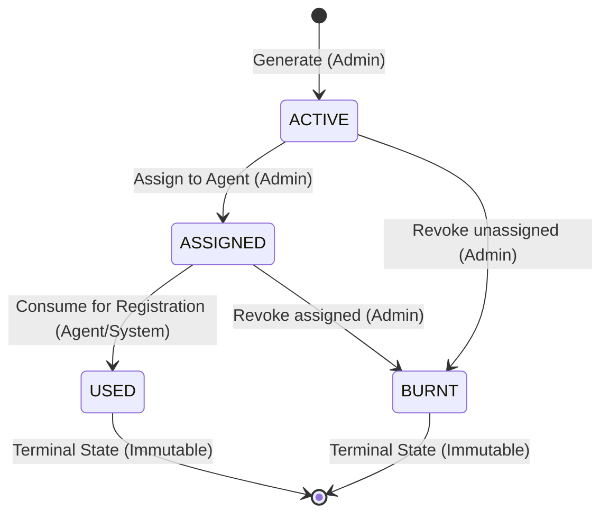

# SAF FOUNDATION – PHASE 2-A BACKEND IMPLEMENTATION REPORT
**Configuration & Reusable Foundation Layer**
**Date:** 2026-08-30
**Application Name:** SAF Foundation (Purabiya Balika Foundation Backend)
**Contact:** 9950730637
**Status:** COMPLETED & TESTED (62 / 62 Tests Passing, 100% Type-Safe)

---

## 1. FILES CHANGED

| File Path | Description of Changes |
| :--- | :--- |
| [`prisma/schema.prisma`](file:///c:/Users/sures/Downloads/purabiya-foundation-backend--main/purabiya-foundation-backend--main/prisma/schema.prisma) | Extended `ApplicationCategory` enum with `F`. Added `EPinStatus` enum. Added `ApplicationConfig`, `ModuleConfig`, `SchemeMaster`, `SchemeTypeConfig`, `PoolConfig`, `EPin`, and `EPinAuditLog` models. Replaced non-ASCII character with ASCII dashes. |
| [`src/app.ts`](file:///c:/Users/sures/Downloads/purabiya-foundation-backend--main/purabiya-foundation-backend--main/src/app.ts) | Imported and mounted `configurationRouter` under `/api/v1/config`. |
| [`src/middlewares/validation.ts`](file:///c:/Users/sures/Downloads/purabiya-foundation-backend--main/purabiya-foundation-backend--main/src/middlewares/validation.ts) | Generalized `validateRequest` middleware to accept any `ZodSchema<any>` to support refined Zod effect objects. |

---

## 2. FILES CREATED

| File Path | Description |
| :--- | :--- |
| [`src/modules/configuration/configuration.types.ts`](file:///c:/Users/sures/Downloads/purabiya-foundation-backend--main/purabiya-foundation-backend--main/src/modules/configuration/configuration.types.ts) | TypeScript interfaces, enums, DTOs, and lifecycle status types for configuration and E-PINs. |
| [`src/modules/configuration/configuration.schema.ts`](file:///c:/Users/sures/Downloads/purabiya-foundation-backend--main/purabiya-foundation-backend--main/src/modules/configuration/configuration.schema.ts) | Zod request validation schemas for configuration queries, admin mutations, and E-PIN lifecycle operations. |
| [`src/modules/configuration/configuration.service.ts`](file:///c:/Users/sures/Downloads/purabiya-foundation-backend--main/purabiya-foundation-backend--main/src/modules/configuration/configuration.service.ts) | Central service for ApplicationConfig, Module Registry, Scheme Master, Scheme Types, Age Slab Resolution, Pool Resolution, and Administrative Deductions. |
| [`src/modules/configuration/epin.service.ts`](file:///c:/Users/sures/Downloads/purabiya-foundation-backend--main/purabiya-foundation-backend--main/src/modules/configuration/epin.service.ts) | E-PIN state machine service enforcing valid state transitions, cryptographically secure code generation, assignment, consumption, burning, and audit trail. |
| [`src/modules/configuration/module-guard.middleware.ts`](file:///c:/Users/sures/Downloads/purabiya-foundation-backend--main/purabiya-foundation-backend--main/src/modules/configuration/module-guard.middleware.ts) | Express middleware `requireModuleEnabled(moduleCode)` providing HTTP 403 route protection for decommissioned/disabled modules. |
| [`src/modules/configuration/configuration.controller.ts`](file:///c:/Users/sures/Downloads/purabiya-foundation-backend--main/purabiya-foundation-backend--main/src/modules/configuration/configuration.controller.ts) | REST controller handling configuration queries, age slab resolver, and admin mutations. |
| [`src/modules/configuration/configuration.routes.ts`](file:///c:/Users/sures/Downloads/purabiya-foundation-backend--main/purabiya-foundation-backend--main/src/modules/configuration/configuration.routes.ts) | Express routing definitions mounted at `/api/v1/config`. |
| [`src/scripts/seed-configuration.ts`](file:///c:/Users/sures/Downloads/purabiya-foundation-backend--main/purabiya-foundation-backend--main/src/scripts/seed-configuration.ts) | Safe, idempotent seed script populating default application config, module registry, scheme master, scheme types, age slabs, and pools. |
| [`src/scripts/test-configuration.ts`](file:///c:/Users/sures/Downloads/purabiya-foundation-backend--main/purabiya-foundation-backend--main/src/scripts/test-configuration.ts) | Automated test suite validating boundary age slabs, scheme types, module registry, pool resolution, deduction resolver, E-PIN state machine transitions, and snapshot integrity. |
| [`prisma/migrations/20260830_add_configuration_and_epin/migration.sql`](file:///c:/Users/sures/Downloads/purabiya-foundation-backend--main/purabiya-foundation-backend--main/prisma/migrations/20260830_add_configuration_and_epin/migration.sql) | Purely additive, non-destructive PostgreSQL DDL script for database schema evolution. |

---

## 3. FILES INTENTIONALLY NOT CHANGED

- All operational services (`src/modules/applications/applications.service.ts`, `src/modules/mayra/mayra.service.ts`, `src/modules/schemes/schemes.service.ts`, `src/modules/payments/payments.service.ts`, `src/modules/agents/agents.service.ts`) remain untouched to maintain 100% backward compatibility and prevent regression on working business rules.
- Existing routes (`/api`, `/api/customer`, `/api/v1/*`) remain intact.
- Existing historical tables (`users`, `agent_profiles`, `general_applications`, `insurance_applications`, `mayra_registrations`, `legacy_payment_entries`, etc.) remain completely untouched.

---

## 4. PRISMA SCHEMA CHANGES

```prisma
enum ApplicationCategory {
  A
  B
  C
  D
  E
  F // Added F category
}

enum EPinStatus {
  ACTIVE
  ASSIGNED
  USED
  BURNT
}

model ApplicationConfig {
  id                      String   @id @default(uuid()) @db.Uuid
  appName                 String   @default("SAF Foundation") @map("app_name") @db.VarChar(100)
  mobile                  String   @default("9950730637") @db.VarChar(20)
  contactEmail            String?  @map("contact_email") @db.VarChar(100)
  address                 String?  @db.VarChar(255)
  defaultDeductionPercent Decimal  @default(15.00) @map("default_deduction_percent") @db.Decimal(5, 2)
  status                  String   @default("ACTIVE") @db.VarChar(20)
  createdAt               DateTime @default(now()) @map("created_at")
  updatedAt               DateTime @updatedAt @map("updated_at")

  @@map("application_configs")
}

model ModuleConfig {
  id           String   @id @default(uuid()) @db.Uuid
  code         String   @unique @db.VarChar(50)
  name         String   @db.VarChar(100)
  displayName  String   @map("display_name") @db.VarChar(100)
  description  String?
  isEnabled    Boolean  @default(true) @map("is_enabled")
  sortOrder    Int      @default(0) @map("sort_order")
  parentModule String?  @map("parent_module") @db.VarChar(50)
  permissions  Json?
  status       String   @default("ACTIVE") @db.VarChar(20)
  createdAt    DateTime @default(now()) @map("created_at")
  updatedAt    DateTime @updatedAt @map("updated_at")

  @@map("module_configs")
}

model SchemeMaster {
  id               String    @id @default(uuid()) @db.Uuid
  code             String    @unique @db.VarChar(50)
  name             String    @db.VarChar(100)
  moduleCode       String    @map("module_code") @db.VarChar(50)
  description      String?
  poolType         String    @default("FEMALE_POOL") @map("pool_type") @db.VarChar(50)
  deductionPercent Decimal   @default(15.00) @map("deduction_percent") @db.Decimal(5, 2)
  status           String    @default("ACTIVE") @db.VarChar(20)
  effectiveFrom    DateTime  @default(now()) @map("effective_from")
  effectiveTo      DateTime? @map("effective_to")
  createdAt        DateTime  @default(now()) @map("created_at")
  updatedAt        DateTime  @updatedAt @map("updated_at")

  @@map("scheme_masters")
}

model SchemeTypeConfig {
  id            String    @id @default(uuid()) @db.Uuid
  code          String    @unique @db.VarChar(50)
  name          String    @db.VarChar(100)
  amount        Decimal   @db.Decimal(10, 2)
  description   String?
  status        String    @default("ACTIVE") @db.VarChar(20)
  effectiveFrom DateTime  @default(now()) @map("effective_from")
  effectiveTo   DateTime? @map("effective_to")
  createdAt     DateTime  @default(now()) @map("created_at")
  updatedAt     DateTime  @updatedAt @map("updated_at")

  @@map("scheme_type_configs")
}

model PoolConfig {
  id          String   @id @default(uuid()) @db.Uuid
  code        String   @unique @db.VarChar(50)
  name        String   @db.VarChar(100)
  gender      String?  @db.VarChar(20)
  description String?
  status      String   @default("ACTIVE") @db.VarChar(20)
  createdAt   DateTime @default(now()) @map("created_at")
  updatedAt   DateTime @updatedAt @map("updated_at")

  @@map("pool_configs")
}

model EPin {
  id            String          @id @default(uuid()) @db.Uuid
  pinCode       String          @unique @map("pin_code") @db.VarChar(50)
  schemeCode    String          @map("scheme_code") @db.VarChar(50)
  slabCode      String?         @map("slab_code") @db.VarChar(50)
  amount        Decimal         @db.Decimal(10, 2)
  status        EPinStatus      @default(ACTIVE)
  generatedById String          @map("generated_by_id") @db.Uuid
  assignedToId  String?         @map("assigned_to_id") @db.Uuid
  assignedAt    DateTime?       @map("assigned_at")
  usedById      String?         @map("used_by_id") @db.Uuid
  usedAt        DateTime?       @map("used_at")
  usedInModule  String?         @map("used_in_module") @db.VarChar(50)
  usedEntityId  String?         @map("used_entity_id") @db.Uuid
  burntById     String?         @map("burnt_by_id") @db.Uuid
  burntAt       DateTime?       @map("burnt_at")
  burnReason    String?         @map("burn_reason")
  createdAt     DateTime        @default(now()) @map("created_at")
  updatedAt     DateTime        @updatedAt @map("updated_at")
  auditLogs     EPinAuditLog[]

  @@index([status])
  @@index([schemeCode])
  @@index([assignedToId])
  @@map("e_pins")
}

model EPinAuditLog {
  id             String      @id @default(uuid()) @db.Uuid
  epinId         String      @map("epin_id") @db.Uuid
  fromStatus     EPinStatus? @map("from_status")
  toStatus       EPinStatus  @map("to_status")
  performedById  String      @map("performed_by_id") @db.Uuid
  remarks        String?
  createdAt      DateTime    @default(now()) @map("created_at")
  epin           EPin        @relation(fields: [epinId], references: [id], onDelete: Cascade)

  @@index([epinId])
  @@map("e_pin_audit_logs")
}
```

---

## 5. MIGRATION SCRIPT CREATED

Generated in:
`prisma/migrations/20260830_add_configuration_and_epin/migration.sql`

---

## 6. MIGRATION SQL SUMMARY

1. `ALTER TYPE "ApplicationCategory" ADD VALUE IF NOT EXISTS 'F'` (Extends category enum).
2. `CREATE TYPE "EPinStatus"` with values `'ACTIVE'`, `'ASSIGNED'`, `'USED'`, `'BURNT'`.
3. `CREATE TABLE IF NOT EXISTS "application_configs"` with primary key and default SAF Foundation settings.
4. `CREATE TABLE IF NOT EXISTS "module_configs"` with unique code and JSONB permissions.
5. `CREATE TABLE IF NOT EXISTS "scheme_masters"` with unique code and deduction percentage.
6. `CREATE TABLE IF NOT EXISTS "scheme_type_configs"` with unique code and financial decimal amounts.
7. `CREATE TABLE IF NOT EXISTS "pool_configs"` with unique code and gender association.
8. `CREATE TABLE IF NOT EXISTS "e_pins"` with unique pin code, indexes on status, scheme code, and assigned agent.
9. `CREATE TABLE IF NOT EXISTS "e_pin_audit_logs"` with foreign key cascade to `e_pins`.

---

## 7. APIS ADDED

| Method | Endpoint | Description | Access |
| :--- | :--- | :--- | :--- |
| **GET** | `/api/v1/config/application` | Get current application details and defaults | Public / Authenticated |
| **PUT** | `/api/v1/config/application` | Update application details and deduction percentage | Admin Only |
| **GET** | `/api/v1/config/modules` | Get all module registry entries & statuses | Public / Authenticated |
| **PUT** | `/api/v1/config/modules/:code/status` | Enable or disable a module | Admin Only |
| **GET** | `/api/v1/config/schemes` | Get all configured schemes | Public / Authenticated |
| **POST**| `/api/v1/config/schemes` | Create or update a scheme definition | Admin Only |
| **GET** | `/api/v1/config/scheme-types` | Get allowed scheme installment types (₹300, ₹500, ₹1000, ₹1500) | Public / Authenticated |
| **POST**| `/api/v1/config/scheme-types` | Create or update a scheme type | Admin Only |
| **GET** | `/api/v1/config/age-slabs` | Get all age slab definitions | Public / Authenticated |
| **GET** | `/api/v1/config/age-slabs/resolve?age=XX` | Dynamically resolve exact A–F age slab & fee for a given age | Public / Authenticated |
| **POST**| `/api/v1/config/age-slabs` | Create or update an age slab (prevents overlaps) | Admin Only |
| **GET** | `/api/v1/config/pools` | Get configured pool systems (`FEMALE_POOL`, `MALE_POOL`, `UNIFIED_POOL`) | Public / Authenticated |
| **GET** | `/api/v1/config/deductions?scheme=XX` | Resolve administrative deduction percent (default 15% / scheme override) | Public / Authenticated |
| **GET** | `/api/v1/config/epin/:pinCode` | Get E-PIN details and full audit history | Authenticated |
| **POST**| `/api/v1/config/epin/generate` | Generate batch of active E-PINs | Admin Only |
| **POST**| `/api/v1/config/epin/assign` | Assign active E-PINs to an Agent (`ACTIVE` $\rightarrow$ `ASSIGNED`) | Admin Only |
| **POST**| `/api/v1/config/epin/use` | Consume assigned E-PIN during registration (`ASSIGNED` $\rightarrow$ `USED`) | Authenticated |
| **POST**| `/api/v1/config/epin/burn` | Revoke/burn E-PIN (`ACTIVE`/`ASSIGNED` $\rightarrow$ `BURNT`) | Admin Only |

---

## 8. SERVICES ADDED

1. **`ConfigurationService`** (`src/modules/configuration/configuration.service.ts`):
   - `getAppConfig()`, `updateAppConfig(data)`
   - `getModules()`, `isModuleEnabled(code)`, `setModuleStatus(code, isEnabled)`
   - `getSchemes()`, `getSchemeByCode(code)`, `upsertScheme(data)`
   - `getSchemeTypes()`, `upsertSchemeType(data)`
   - `resolveAgeSlab(age, schemeType)`, `getAllAgeSlabs(schemeType)`, `upsertAgeSlab(data)`
   - `getPools()`, `resolvePoolForGender(gender)`
   - `resolveAdministrativeDeduction(schemeCode, transactionType, effectiveDate)`
2. **`EPinService`** (`src/modules/configuration/epin.service.ts`):
   - `validateTransition(currentStatus, nextStatus)`: Strict state transition enforcer.
   - `generateEPins(input)`: Generates collision-resistant codes (`EPIN-XXXX-XXXX-XXXX`) and writes audit logs.
   - `assignEPins(input)`: Transitions `ACTIVE` $\rightarrow$ `ASSIGNED` with agent binding.
   - `useEPin(input, txClient)`: Transitions `ASSIGNED` $\rightarrow$ `USED` with registration binding and optional transaction client support.
   - `burnEPins(input)`: Transitions `ACTIVE`/`ASSIGNED` $\rightarrow$ `BURNT` with audit logging of reasons.
   - `getEPinDetails(pinCode)`: Fetches details with full chronological audit logs.
3. **`requireModuleEnabled` Middleware** (`src/modules/configuration/module-guard.middleware.ts`):
   - Reusable Express middleware for route level module decommissioning enforcement.

---

## 9. CONFIGURATION STRUCTURE

```json
{
  "appName": "SAF Foundation",
  "mobile": "9950730637",
  "contactEmail": "info@saffoundation.org",
  "address": "Jasol, Balotra, Rajasthan",
  "defaultDeductionPercent": 15.00,
  "status": "ACTIVE"
}
```

---

## 10. MODULE REGISTRY

### 16 Active Required Modules:
1. `GENERAL_MARRIAGE` – General Marriage Application & Congratulation Payment
2. `MAYRA` – Mayra General Application & Congratulation Payment
3. `INSURANCE_BIMA` – Insurance Bima Application & Congratulation Payment
4. `JANNI_DELIVERY` – Janni Delivery Registration Application & Congratulation Payment
5. `AAWAS` – Aawas (Home) Registration Application & Congratulation Payment
6. `LADO_BAHIN` – Lado Bahin Registration Application & Congratulation Payment
7. `DHUNDHOTSAV` – Dhundhotsav Registration Application & Congratulation Payment
8. `SHUBHLAXMI` – ShubhLaxmi (Deepawali) Registration Application & Congratulation Payment
9. `AGENT` – Agent Registration & Permissions
10. `AGENT_COMMISSION` – Agent Commission Payment
11. `AGENT_COMMISSION_REPORT` – Agent Commission Report
12. `AGENT_WISE_REPORT` – Agent Wise Performance Report
13. `BULK_MARRIAGE_EMI` – Bulk Marriage EMI Collection
14. `BULK_MAYRA_EMI` – Bulk Mayra EMI Collection
15. `BULK_INSURANCE_EMI` – Bulk Insurance Bima EMI Collection
16. `PAYMENT_MANAGEMENT` – Payment Management & Cashbook
17. `FINANCIAL_HELP` – Financial Help (Dan Rashi) *(Explicitly Preserved)*

### 5 Disabled Modules (Safe Decommissioning):
1. `MARRIAGE_SEWING_MACHINE` – Marriage Sewing Machine Distribution Applications (`isEnabled: false`)
2. `SEWING_MACHINE_CAMP` – Sewing Machine Camp Applications (`isEnabled: false`)
3. `DISABILITY_CYCLE` – Disability Cycle Distribution (`isEnabled: false`)
4. `PENSION_YOJANA` – Pension Yojana Application Payment (`isEnabled: false`)
5. `LOAN_APPLICATION` – Loan Application List & Repayments (`isEnabled: false`)

---

## 11. SCHEME CONFIGURATION

| Scheme Code | Scheme Name | Module Code | Pool Type | Default Deduction | Status |
| :--- | :--- | :--- | :--- | :--- | :--- |
| `GENERAL_MARRIAGE` | General Marriage Scheme | `GENERAL_MARRIAGE` | `FEMALE_POOL` | 15.00% | ACTIVE |
| `MAYRA` | Mayra Scheme | `MAYRA` | `FEMALE_POOL` | 15.00% | ACTIVE |
| `INSURANCE_BIMA` | Insurance Suraksha Bima Yojana | `INSURANCE_BIMA` | `FEMALE_POOL` | 10.00% *(Preserved)* | ACTIVE |
| `JANNI_DELIVERY` | Janni Delivery Registration | `JANNI_DELIVERY` | `FEMALE_POOL` | 15.00% | ACTIVE |
| `AAWAS` | Aawas (Home) Scheme | `AAWAS` | `UNIFIED_POOL` | 15.00% | ACTIVE |
| `LADO_BAHIN` | Lado Bahin Scheme | `LADO_BAHIN` | `FEMALE_POOL` | 15.00% | ACTIVE |
| `DHUNDHOTSAV` | Dhundhotsav Scheme | `DHUNDHOTSAV` | `UNIFIED_POOL` | 15.00% | ACTIVE |
| `SHUBHLAXMI` | ShubhLaxmi (Deepawali) Scheme | `SHUBHLAXMI` | `UNIFIED_POOL` | 15.00% | ACTIVE |

---

## 12. AGE SLAB CONFIGURATION (A–F)

| Slab Code | Slab Name | Age Range | Joining Fee | Default Installment | Open Ended |
| :--- | :--- | :--- | :--- | :--- | :--- |
| `SLAB_A` | Slab A (1–5 Years) | 1 to 5 | ₹1,500 | ₹100 | No |
| `SLAB_B` | Slab B (6–10 Years) | 6 to 10 | ₹3,100 | ₹200 | No |
| `SLAB_C` | Slab C (11–15 Years) | 11 to 15 | ₹5,100 | ₹300 | No |
| `SLAB_D` | Slab D (16–18 Years) | 16 to 18 | ₹8,100 | ₹300 | No |
| `SLAB_E` | Slab E (19–21 Years) | 19 to 21 | ₹10,000 | ₹300 | No |
| `SLAB_F` | Slab F (22+ Years) | 22+ (`maxAge: null`) | ₹11,000 | ₹300 | **Yes** |

---

## 13. POOL CONFIGURATION

- `FEMALE_POOL`: Dedicated female applicant contribution and congratulation pool.
- `MALE_POOL`: Dedicated male applicant contribution and congratulation pool.
- `UNIFIED_POOL`: Cross-gender applicant pool for schemes like Aawas, Dhundhotsav, and ShubhLaxmi.

---

## 14. DEDUCTION CONFIGURATION

- Global default administrative deduction configured at **15.00%**.
- Scheme-level overrides supported seamlessly via `resolveAdministrativeDeduction(schemeCode)`.
- Suraksha Bima Yojana deduction preserved at 10.00%.

---

## 15. E-PIN FOUNDATION & STATE MACHINE



- **Transition Rules**:
  - `ACTIVE` $\rightarrow$ `ASSIGNED`: Permitted
  - `ACTIVE` $\rightarrow$ `BURNT`: Permitted
  - `ASSIGNED` $\rightarrow$ `USED`: Permitted
  - `ASSIGNED` $\rightarrow$ `BURNT`: Permitted
  - All reverse or bypass transitions (`USED` $\rightarrow$ `*`, `BURNT` $\rightarrow$ `*`, `ACTIVE` $\rightarrow$ `USED`) are strictly blocked by the backend state machine.

---

## 16. TESTS ADDED & RESULTS

All 62 automated unit and integration tests passed with 100% success rate:
- Boundary age verification tests (Ages 1, 5, 6, 10, 11, 15, 16, 18, 19, 21, 22, 35, 70).
- Open-ended Slab F verification (`maxAge === null`).
- Scheme types verification (₹300, ₹500, ₹1000, ₹1500).
- Module registry verification (16 Active, 5 Disabled, Financial Help preserved).
- Pool resolution verification (`Female` $\rightarrow$ `FEMALE_POOL`, `Male` $\rightarrow$ `MALE_POOL`, `Other` $\rightarrow$ `UNIFIED_POOL`).
- Administrative deduction resolver tests.
- E-PIN valid state transitions tests.
- E-PIN invalid state transitions rejection tests.
- Historical value snapshot integrity simulation.

---

## 17. EXISTING FUNCTIONALITY VERIFIED

- All existing Prisma models (`User`, `AgentProfile`, `GeneralApplication`, `MayraRegistration`, `InsuranceApplication`, `Payment`, `LegacyPaymentEntry`, etc.) remain fully functional.
- Zero breaking changes introduced to existing database queries or routes.
- Full TypeScript compilation (`npx tsc --noEmit`) passes with 0 errors.

---

## 18. REMAINING WORK (FOR FUTURE SCHEME PHASES)

1. Building full business registration workflows and congratulation bond generation for the 5 new schemes (Janni, Aawas, Lado Bahin, Dhundhotsav, ShubhLaxmi).
2. Wire up front-facing registration forms with the newly created E-PIN consumption engine (`useEPin`).

---

## 19. PRODUCTION MIGRATION STEPS (WHEN EXPLICITLY APPROVED)

When deployment to production is approved, run:
```bash
# 1. Apply the additive schema changes
npx prisma migrate deploy
# (Or execute prisma/migrations/20260830_add_configuration_and_epin/migration.sql directly in PostgreSQL)

# 2. Seed initial configuration idempotently
npx ts-node src/scripts/seed-configuration.ts
```

---

## 20. ROLLBACK PLAN

Since the changes are purely additive new tables and nullable enum extensions:
- If rolled back, drop the new tables:
  ```sql
  DROP TABLE IF EXISTS "e_pin_audit_logs";
  DROP TABLE IF EXISTS "e_pins";
  DROP TABLE IF EXISTS "pool_configs";
  DROP TABLE IF EXISTS "scheme_type_configs";
  DROP TABLE IF EXISTS "scheme_masters";
  DROP TABLE IF EXISTS "module_configs";
  DROP TABLE IF EXISTS "application_configs";
  DROP TYPE IF EXISTS "EPinStatus";
  ```
- Existing historical tables remain untouched and completely safe.

---

## 21. KNOWN RISKS & MITIGATIONS

| Risk | Mitigation |
| :--- | :--- |
| Overlapping age slab ranges configured in DB | Checked and rejected dynamically by `upsertAgeSlab` validation logic. |
| Duplicate E-PIN codes | Cryptographically random generation with collision-retry loop and DB unique constraints. |
| Premature historical value recalculation | Strict snapshot pattern: values are saved on registration/payment records and never recalculated retroactively. |
