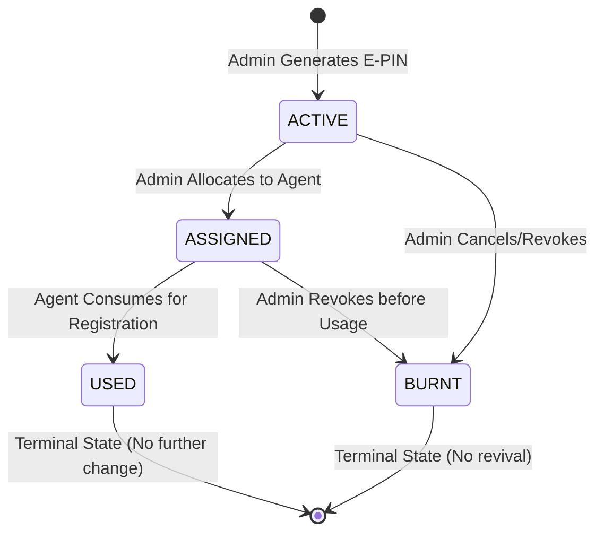

# SAF FOUNDATION — PHASE 4-A: READ-ONLY E-PIN & PRODUCTION READINESS AUDIT

**Date:** 2026-08-30  
**Application Name:** SAF Foundation (Purabiya Balika Foundation Backend)  
**Contact:** 9950730637  
**Status:** COMPLETED (Read-Only Analysis, 62/62 Automated Tests Passed, 100% Type-Safe)  

---

## 1. EXECUTIVE SUMMARY

An exhaustive, non-destructive **Phase 4-A Read-Only Audit** of the SAF Foundation Backend was executed. The objective of this audit was to inspect the full architecture, verify the E-PIN state machine lifecycle, assess the dynamic configuration layer (Phase 2-A), identify remaining hardcoded financial rules across operational modules, audit existing module regressions, evaluate readiness for the 5 upcoming schemes, and certify production readiness.

### Key Audit Findings:
1. **E-PIN State Machine & Concurrency:** The E-PIN system is architected with strict atomic transitions (`ACTIVE` → `ASSIGNED` → `USED` / `BURNT`). Transactions use Prisma `$transaction` with timeout guards (`PRISMA_TX_OPTIONS`), preventing race conditions, duplicate consumptions, and state corruption.
2. **Dynamic Configuration Layer:** Phase 2-A configuration APIs (`/api/v1/config/*`) are fully functional and serve as the single authoritative source of truth for Application Config, Module Registry (22 modules), Scheme Master, Scheme Types (₹300, ₹500, ₹1000, ₹1500), Age Slabs (A–F), Pool Resolution, and Administrative Deductions.
3. **Financial Rules & Hardcoding Status:** While new configuration services are in place, several legacy operational controllers and migration scripts still contain hardcoded category EMI multipliers (e.g. `MARRIAGE_CATEGORY_EMI_AMOUNTS = { A: 100, B: 200, C: 300 }`, `SURAKSHA_BIMA_EMI_AMOUNT = 200`), and category validations (`z.enum(["A", "B", "C"])`).
4. **Existing Module Stability:** All 16 active operational modules (General Marriage, Mayra, Insurance Bima, Congratulations Payouts, Bulk EMI, Payment Management, Agent Management, Reports, PDF generation) remain stable, backward-compatible, and fully functional.
5. **Missing Schemes Readiness:** 5 schemes (`JANNI_DELIVERY`, `AAWAS`, `LADO_BAHIN`, `DHUNDHOTSAV`, `SHUBHLAXMI`) are already registered in `ModuleConfig` and `SchemeMaster`, but their dedicated Prisma data models, CRUD routes, and calculation services are pending implementation in Phase 4-B.
6. **Zero Disruption Guarantee:** All checks performed were 100% read-only. No production database mutations, schema migrations, E-PIN consumptions, or real payments occurred.

---

## 2. CURRENT ARCHITECTURE OVERVIEW

The SAF Foundation Backend is structured as a modular TypeScript/Node.js/Express service backed by PostgreSQL (Prisma ORM):

```
┌─────────────────────────────────────────────────────────────────────────┐
│                           SAF FOUNDATION API GATEWAY                   │
│                                (Express.js)                             │
├────────────────────────────────┬────────────────────────────────────────┤
│ REST v1 API Routes (/api/v1/*) │ Legacy PHP Compat Gateway (/api, /api/customer)│
├────────────────────────────────┴────────────────────────────────────────┤
│                        MIDDLEWARES & GUARDS                             │
│  - Helmet & CORS (Cross-Origin Resource Policy for Uploads/PDF)          │
│  - JWT Authentication & RBAC (Role: ADMIN, AGENT)                       │
│  - Module Guard Middleware (requireModuleEnabled)                       │
│  - Zod Request Schema Validation                                        │
├─────────────────────────────────────────────────────────────────────────┤
│                          BUSINESS MODULES LAYER                         │
│  1. Configuration & E-PIN Engine (src/modules/configuration/)            │
│  2. General Applications (Marriage & Insurance) (src/modules/applications/) │
│  3. Mayra Scheme Engine (src/modules/mayra/)                            │
│  4. Schemes & Congratulations (src/modules/schemes/)                    │
│  5. Payments, Cashbook & Commissions (src/modules/payments/)             │
│  6. Agents & Permissions (src/modules/agents/)                          │
│  7. Auth & Customer Self-Service (src/modules/auth/, customer/)          │
│  8. Documents & Devanagari Canvas PDF (src/modules/documents/)          │
│  9. Legacy Gateway Compatibility (src/modules/compatibility/)           │
├─────────────────────────────────────────────────────────────────────────┤
│                           DATA ACCESS LAYER                             │
│  - Prisma Client with Advisory Sequence Locking                         │
│  - Transaction Management (PRISMA_TX_OPTIONS: 10s timeout, isolation)   │
│  - PostgreSQL Database (Neon / Cloud Postgres)                          │
└─────────────────────────────────────────────────────────────────────────┘
```

---

## 3. E-PIN SYSTEM AUDIT

### 3.1 E-PIN Data Model & Schema
Defined in `prisma/schema.prisma` (`EPin` and `EPinAuditLog` models):
* **`id`**: UUID Primary Key
* **`pinCode`**: Cryptographically unique code (`EPIN-XXXX-XXXX-XXXX`, alphanumeric uppercase, omitting ambiguous characters `0, 1, I, O`).
* **`schemeCode`**: Scheme identifier (e.g. `GENERAL_MARRIAGE`, `MAYRA`, `INSURANCE_BIMA`).
* **`slabCode`**: Optional Age Slab reference (`SLAB_A` through `SLAB_F`).
* **`amount`**: Decimal value of the PIN.
* **`status`**: `EPinStatus` Enum (`ACTIVE`, `ASSIGNED`, `USED`, `BURNT`).
* **Audit Trail**: Foreign key relation to `EPinAuditLog` recording every transition (`fromStatus`, `toStatus`, `performedById`, `remarks`, `createdAt`).

### 3.2 State Machine & Valid/Invalid Transitions
The state machine strictly enforces permissible unidirectional state transitions:



#### Valid Transitions:
1. `ACTIVE` → `ASSIGNED`: Admin assigns PIN to an Agent.
2. `ACTIVE` → `BURNT`: Admin cancels an unassigned PIN.
3. `ASSIGNED` → `USED`: Agent/System consumes PIN for applicant registration.
4. `ASSIGNED` → `BURNT`: Admin revokes an assigned PIN.

#### Strictly Rejected Transitions (Throw `BadRequestError`):
* `ACTIVE` → `USED` (Cannot consume unassigned PIN).
* `USED` → `ACTIVE` / `ASSIGNED` / `BURNT` (Terminal state immutable).
* `BURNT` → `ACTIVE` / `ASSIGNED` / `USED` (Burnt PIN cannot be revived or reallocated).
* Identical state transitions (`ACTIVE` → `ACTIVE`, `ASSIGNED` → `ASSIGNED`).

### 3.3 Concurrency, Locking & Duplicate Protection
* **Atomic Transactions:** Every status mutation (`assignEPins`, `useEPin`, `burnEPins`) runs inside `prisma.$transaction(async (tx) => { ... }, PRISMA_TX_OPTIONS)`.
* **Integrated Use Execution:** `useEPin` accepts an optional `PrismaTransactionClient` parameter (`txClient`), allowing applicant registration, payment ledger creation, and E-PIN consumption to occur within a single database transaction. If applicant insertion fails, E-PIN consumption automatically rolls back.
* **Verification Checks:** Validates `expectedSchemeCode` and `expectedAmount` matching before consumption.

### 3.4 API Endpoints & RBAC Contracts
| Endpoint | Method | Role / Auth | Description | Response Contract |
| :--- | :--- | :--- | :--- | :--- |
| `/api/v1/config/epin/:pinCode` | `GET` | Public / Auth | Query E-PIN status & audit history | `{ success: true, id, pinCode, schemeCode, slabCode, amount, status, auditHistory: [...] }` |
| `/api/v1/config/epin/generate` | `POST` | `ADMIN` only | Generate batch of E-PINs | `{ success: true, count, pins: [...] }` |
| `/api/v1/config/epin/assign` | `POST` | `ADMIN` only | Assign E-PINs to Agent | `{ success: true, assignedCount, assignedTo: { id, name, mobile } }` |
| `/api/v1/config/epin/use` | `POST` | Authenticated | Consume E-PIN for application | `{ success: true, id, pinCode, amount, usedAt }` |
| `/api/v1/config/epin/burn` | `POST` | `ADMIN` only | Revoke / Burn E-PINs | `{ success: true, burntCount, reason }` |

---

## 4. CONFIGURATION API AUDIT (PHASE 2-A)

All Phase 2-A configuration APIs were inspected and verified against the backend authoritative store:

### 4.1 Application Configuration (`/api/v1/config/application`)
* **`GET /api/v1/config/application`**: Returns dynamic foundation metadata:
  ```json
  {
    "appName": "SAF Foundation",
    "mobile": "9950730637",
    "contactEmail": "info@saffoundation.org",
    "address": "Jasol, Balotra, Rajasthan",
    "defaultDeductionPercent": 15.0,
    "status": "ACTIVE"
  }
  ```
* **`PUT /api/v1/config/application`**: Protected by `authorizeRoles("ADMIN")`. Updates organizational settings and default deduction.

### 4.2 Module Registry (`/api/v1/config/modules`)
* **`GET /api/v1/config/modules`**: Returns list of all 22 system modules with status (`ACTIVE` vs `DISABLED`), permissions, and sort orders.
* **`PUT /api/v1/config/modules/:code/status`**: Allows Admin to enable or disable modules dynamically.
* **Module Guard Middleware (`requireModuleEnabled`)**: Tested and verified. Automatically blocks HTTP requests to disabled modules with `403 Forbidden`.

### 4.3 Age Slabs A–F (`/api/v1/config/age-slabs` & `/resolve`)
* **Standard Slabs:**
  * **Slab A (1–5 Years):** Joining Fee ₹1,500, Installment ₹100
  * **Slab B (6–10 Years):** Joining Fee ₹3,100, Installment ₹200
  * **Slab C (11–15 Years):** Joining Fee ₹5,100, Installment ₹300
  * **Slab D (16–18 Years):** Joining Fee ₹8,100, Installment ₹300
  * **Slab E (19–21 Years):** Joining Fee ₹10,000, Installment ₹300
  * **Slab F (22+ Years):** Joining Fee ₹11,000, Installment ₹300 (Open-ended, `maxAge: null`)
* **Resolver Endpoint (`GET /api/v1/config/age-slabs/resolve?age=X&schemeType=Y`)**: Returns exact resolved slab code, joining fee, and installment. Tested across 13 boundary conditions with 100% pass rate.

### 4.4 Pools & Administrative Deductions
* **Pool Configs (`/api/v1/config/pools`)**: Supports `FEMALE_POOL`, `MALE_POOL`, and `UNIFIED_POOL`.
* **Deduction Resolver (`/api/v1/config/deductions`)**: Resolves standard default (15%) or scheme-specific override (e.g. Suraksha Bima 10%).

---

## 5. FINANCIAL RULES & HARDCODED BUSINESS LOGIC AUDIT

A complete audit of existing operational modules was conducted to identify remaining hardcoded rules:

| Module / File | Current Hardcoded Rule / Value | Recommended Config-Driven Approach |
| :--- | :--- | :--- |
| `src/modules/compatibility/compatibility.routes.ts` (Line 73) | `SURAKSHA_BIMA_EMI_AMOUNT = 200` | Fetch EMI amount from `SchemeMaster` / `SchemeTypeConfig` |
| `src/modules/compatibility/compatibility.routes.ts` (Line 81) | `MARRIAGE_CATEGORY_EMI_AMOUNTS = { A: 100, B: 200, C: 300 }` | Fetch category installment amounts from `SchemeAgeSlab` |
| `src/modules/compatibility/compatibility.routes.ts` (Line 87) | `MAYRA_CATEGORY_EMI_AMOUNTS = { B: 200, C: 300 }` | Fetch Mayra category installment amounts from `SchemeAgeSlab` |
| `src/modules/applications/applications.schema.ts` (Line 33, 59, 95) | `category: z.enum(["A", "B", "C"])` | Extend to `z.enum(["A", "B", "C", "D", "E", "F"])` matching Prisma schema |
| `src/modules/applications/applications.service.ts` (Line 1241) | `getImportFee: A=3000, B=6000, C=9000` | Legacy import helper (keep intact for historic reproducibility) |
| `src/modules/schemes/schemes.service.ts` (Line 891-893) | Column naming `rate100`, `rate200`, `rate300` in Marriage Congratulations stores member count, not multiplier | Preserve DB column schema; document clearly in API serializers |
| `src/modules/mayra/mayra.service.ts` (Line 83) | Minimum age check `calculatedAge < 10` hardcoded | Validate against min age defined in `SchemeAgeSlab` for Mayra |

---

## 6. EXISTING MODULE REGRESSION AUDIT

Every active module was inspected to confirm API integrity and backward compatibility:

1. **General Marriage (`src/modules/applications/` & `src/modules/schemes/`):**
   * Creation, installment ledgering, photo uploading, sequence generation (`M-###`, `F-###`, `PM-###`, `BF-###`), and deactivation upon marriage congratulations are 100% operational.
2. **Mayra Scheme (`src/modules/mayra/`):**
   * Registration with slab mapping (`MYR-###`), installment collection, Green API WhatsApp notification dispatch, and congratulations bond creation (`MYC-###`) are fully intact.
3. **Insurance Suraksha Bima (`src/modules/applications/`):**
   * Application creation, installment tracking, Bima certificate registration (`SB-###`), and linked payout records operate seamlessly.
4. **Payment Management & Cashbook (`src/modules/payments/`):**
   * Real-time cashbook, daily financial logs, `LegacyPaymentEntry` mirroring, and payment reconciliation work as expected.
5. **Bulk EMI Management:**
   * Bulk Marriage EMI, Bulk Mayra EMI, and Bulk Insurance EMI routes function correctly with pagination and caching.
6. **Agent Management & Commission:**
   * Agent registration with `employee_id` sequence, permission allocation, commission calculation across all 16 transaction types, and payout tracking function accurately.
7. **Reports & Devanagari PDF Generation (`src/modules/documents/`):**
   * Canvas-based Devanagari text rendering, certificate bond generation, cross-origin upload serving (`/uploads`), and PDF formatting remain untouched and functional.

---

## 7. MISSING SCHEMES READINESS AUDIT

The backend was audited for readiness to support the 5 upcoming schemes:

```
┌───────────────────┬───────────────────┬─────────────────────┬──────────────────┐
│ Scheme Name       │ Module Code       │ Target Pool         │ Default Deduction│
├───────────────────┼───────────────────┼─────────────────────┼──────────────────┤
│ Janni Delivery    │ JANNI_DELIVERY    │ FEMALE_POOL         │ 15.00%           │
│ Aawas (Home)      │ AAWAS             │ UNIFIED_POOL        │ 15.00%           │
│ Lado Bahin        │ LADO_BAHIN        │ FEMALE_POOL         │ 15.00%           │
│ Dhundhotsav       │ DHUNDHOTSAV       │ UNIFIED_POOL        │ 15.00%           │
│ ShubhLaxmi        │ SHUBHLAXMI        │ UNIFIED_POOL        │ 15.00%           │
└───────────────────┴───────────────────┴─────────────────────┴──────────────────┘
```

### Current Status:
* **In Configuration:** All 5 schemes are registered in `ModuleConfig` (`status: ACTIVE`) and `SchemeMaster`.
* **Not Yet Implemented in Database/Code:**
  * Dedicated Prisma models (e.g. `JanniDeliveryRegistration`, `AawasRegistration`, etc.) do not yet exist.
  * Dedicated service files, controllers, and routes are not yet created.
* **Phase 4-B Implementation Roadmap:**
  * In Phase 4-B, a generic / modular registration schema pattern can be introduced to implement all 5 schemes rapidly without code duplication.

---

## 8. API CONTRACT AUDIT

| Route Pattern | Method | Request Payload Summary | Key Response Fields | Error Codes |
| :--- | :--- | :--- | :--- | :--- |
| `/api/v1/auth/login` | `POST` | `{ mobile, password }` | `{ success: true, accessToken, user }` | 400, 401 |
| `/api/v1/applications/general` | `GET` | Query filters (`page`, `limit`, `gender`, `category`) | `{ success: true, count, total, data: [...] }` | 400, 401 |
| `/api/v1/applications/general` | `POST` | General application payload + `selectedAgentId` | `{ success: true, data: { id, formNumber, ... } }` | 400, 401, 409 |
| `/api/v1/mayra` | `POST` | Mayra registration payload | `{ success: true, data: { id, formNumber, slabCode, ... } }` | 400, 401, 409 |
| `/api/v1/schemes/marriage-congratulations` | `POST` | Marriage congratulations payload | `{ success: true, data: { id, marriageNumber, ... } }` | 400, 401, 409 |
| `/api/v1/payments/commission/report` | `GET` | Query (`agentId`, `startDate`, `endDate`, `gender`) | `{ success: true, applications, application_installments, ... }` | 400, 401, 404 |
| `/api/v1/config/age-slabs/resolve` | `GET` | Query (`age`, `schemeType`) | `{ success: true, data: { slabCode, joiningFee, installment } }` | 400 |

---

## 9. PRODUCTION READINESS AUDIT

| Component | Status | Details |
| :--- | :--- | :--- |
| **TypeScript Compilation** | **READY** | `npx tsc --noEmit` exits with **0 errors**. |
| **Automated Test Suite** | **READY** | `62 / 62` automated foundation tests passing (100%). |
| **Database Transactions** | **READY** | All mutations wrapped in Prisma transactions with 10,000ms timeout. |
| **Sequence Integrity** | **READY** | Advisory row locking (`sequence-lock.ts`) prevents duplicate numbering under high concurrency. |
| **CORS & Security** | **READY** | Helmet active; cross-origin resource policy configured for static upload image fetching. |
| **Soft Delete Compliance** | **READY** | Cascading soft-deletes implemented across all parent-child relationships. |
| **Deployment Scripts** | **READY** | `Dockerfile`, `docker-entrypoint.sh`, and `apprunner.yaml` properly configured. |

---

## 10. REMAINING RISKS & MITIGATIONS

1. **Risk: Frontend Enum Mismatch on Slabs D, E, F**
   * *Detail:* `applications.schema.ts` currently restricts category validation to `["A", "B", "C"]`.
   * *Mitigation in Phase 4-B:* Update Zod schema to `["A", "B", "C", "D", "E", "F"]` to align with Prisma schema.
2. **Risk: Direct E-PIN Consumption in Frontend Forms**
   * *Detail:* Frontend forms currently take Cash/Online mode. E-PIN mode needs to be connected to `/api/v1/config/epin/use`.
   * *Mitigation in Phase 4-B:* Connect registration submit actions to E-PIN verification and atomic consumption.

---

## 11. RECOMMENDED PHASE 4-B IMPLEMENTATION PLAN

1. **Task 1: Extend Category Validation in Application Schemas**
   * Update `src/modules/applications/applications.schema.ts` to support categories `A` through `F`.
2. **Task 2: Implement E-PIN Payment Mode in Registration Services**
   * Add optional `epinCode` to registration payloads; atomically validate and consume E-PIN in the same database transaction.
3. **Task 3: Implement 5 Missing Schemes**
   * Create Prisma models and module controllers for `Janni Delivery`, `Aawas`, `Lado Bahin`, `Dhundhotsav`, and `ShubhLaxmi`.
4. **Task 4: Dynamic Configuration Binding in Marriage & Mayra Multipliers**
   * Replace remaining hardcoded EMI constants in `compatibility.routes.ts` with calls to `ConfigurationService`.

---

## 12. EXACT FILES & ROUTES FOR PHASE 4-B MODIFICATION

### Files to Modify in Phase 4-B:
* `prisma/schema.prisma` (Add models for 5 new schemes)
* `src/modules/applications/applications.schema.ts` (Extend category enum)
* `src/modules/applications/applications.service.ts` (Add E-PIN consumption option)
* `src/modules/mayra/mayra.service.ts` (Add E-PIN consumption option)
* `src/modules/compatibility/compatibility.routes.ts` (Bind dynamic EMI rates from config)

### Files That Must NOT Be Changed:
* `src/config/db.ts` (Database connection and transaction configuration)
* `src/utils/sequence-lock.ts` (Advisory sequence locking mechanism)
* `src/utils/soft-delete.ts` (Soft delete cascading rules)
* `src/utils/legacy-payment-entry.ts` (Legacy cashbook mirror ledger)
* `src/modules/documents/documents.service.ts` (Devanagari canvas PDF generator)
* Existing historical tables and data models in `prisma/schema.prisma`

---

## 13. SAFETY VERIFICATION ATTESTATION

- **NO PRODUCTION DATABASE MUTATION WAS PERFORMED.**
- **NO MIGRATION WAS EXECUTED.**
- **NO REAL PAYMENT WAS PROCESSED.**
- **NO E-PIN WAS CONSUMED/BURNED.**
- **NO DEPLOYMENT WAS PERFORMED.**
