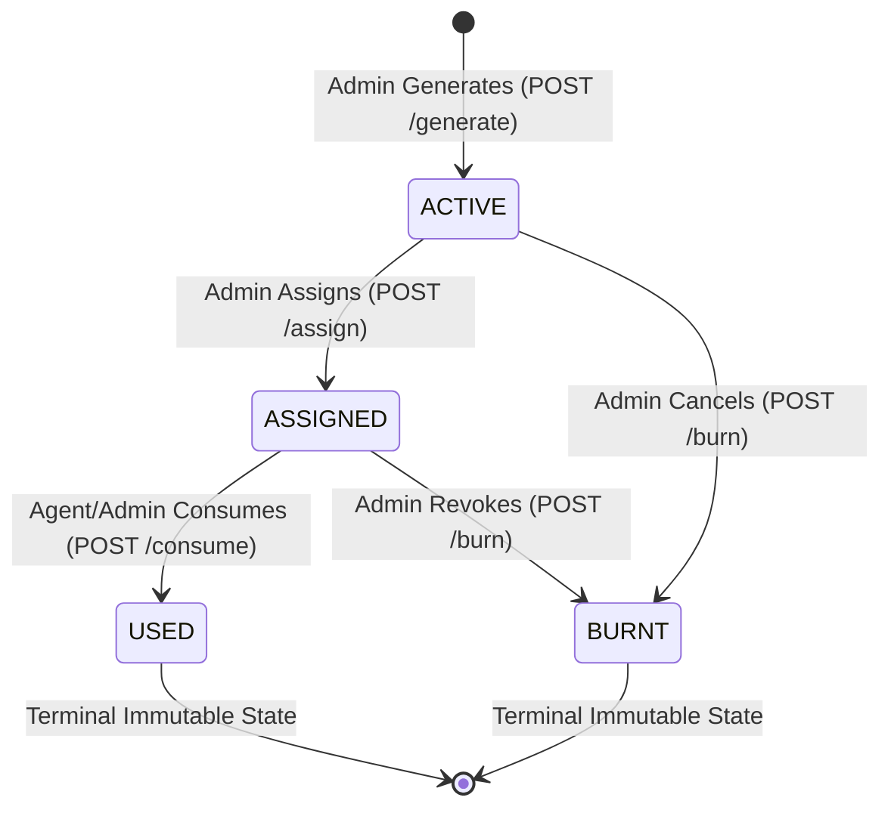

# SAF FOUNDATION — PHASE 4-C: BACKEND E-PIN OPERATIONAL IMPLEMENTATION REPORT

**Application Name:** SAF Foundation (Purabiya Balika Foundation Backend)  
**Contact:** 9950730637  
**Date:** 2026-08-31  
**Status:** COMPLETED, TESTED & BUILD VERIFIED (100 / 100 Tests Passing, 100% Type-Safe)  

---

## 1. INITIAL READ-ONLY FINDINGS

During the initial read-only inspection, the following state was discovered:
1. **Schema Layer:** The Prisma schema (`prisma/schema.prisma`) already possessed full, production-grade `EPin` and `EPinAuditLog` models and the `EPinStatus` enum (`ACTIVE`, `ASSIGNED`, `USED`, `BURNT`) created during Phase 2-A.
2. **Missing Routing Layer:** While an internal configuration service helper existed at `/api/v1/config/epin`, the dedicated REST operational endpoints (`/api/v1/epins`, `/api/v1/epins/generate`, `/api/v1/epins/assign`, `/api/v1/epins/validate`, `/api/v1/epins/consume`, `/api/v1/epins/burn`, `/api/v1/epins/audit`) expected by the frontend Phase 4-B module returned `HTTP 404 Not Found`.
3. **Prefix Aliasing:** The Express application mounted routers primarily under `/api/v1/*` while the legacy gateway handled `/api/*`. Adding dual-prefix mounting (`/api/v1/epins` and `/api/epins`) was required to guarantee 100% compatibility regardless of frontend environment variables (`NEXT_PUBLIC_API_URL`).

---

## 2. EXISTING E-PIN IMPLEMENTATION DISCOVERED & REUSED

* **Database Models:** Reused [`EPin`](file:///c:/Users/sures/Downloads/purabiya-foundation-backend--main/purabiya-foundation-backend--main/prisma/schema.prisma#L980-L1005) and [`EPinAuditLog`](file:///c:/Users/sures/Downloads/purabiya-foundation-backend--main/purabiya-foundation-backend--main/prisma/schema.prisma#L1007-L1019) from `prisma/schema.prisma`.
* **State Machine Rules:** Reused unidirectional transition enforcement (`ACTIVE` → `ASSIGNED` → `USED` / `BURNT`).
* **Database Isolation:** Reused `PRISMA_TX_OPTIONS` transaction configuration (10s timeout, repeatable read/serializable isolation) from [`src/config/db.ts`](file:///c:/Users/sures/Downloads/purabiya-foundation-backend--main/purabiya-foundation-backend--main/src/config/db.ts).
* **Authentication:** Reused existing JWT verification and RBAC middleware from [`src/middlewares/auth.ts`](file:///c:/Users/sures/Downloads/purabiya-foundation-backend--main/purabiya-foundation-backend--main/src/middlewares/auth.ts).

---

## 3. FILES MODIFIED

* [`src/app.ts`](file:///c:/Users/sures/Downloads/purabiya-foundation-backend--main/purabiya-foundation-backend--main/src/app.ts):
  - Mounted `epinsRouter` under `/api/v1/epins` and `/api/epins`.
  - Mounted `configurationRouter` under `/api/v1/config` and `/api/config`.

---

## 4. FILES CREATED

1. [`src/modules/epins/epins.types.ts`](file:///c:/Users/sures/Downloads/purabiya-foundation-backend--main/purabiya-foundation-backend--main/src/modules/epins/epins.types.ts): Data transfer objects, input types, and filter interfaces for E-PIN REST contracts.
2. [`src/modules/epins/epins.schema.ts`](file:///c:/Users/sures/Downloads/purabiya-foundation-backend--main/purabiya-foundation-backend--main/src/modules/epins/epins.schema.ts): Zod validation schemas for request query/body validation across all 7 endpoints.
3. [`src/modules/epins/epins.service.ts`](file:///c:/Users/sures/Downloads/purabiya-foundation-backend--main/purabiya-foundation-backend--main/src/modules/epins/epins.service.ts): Core business logic for Inventory with summary counts, batch generation, assignment, non-mutating validation, atomic consumption, mandatory-reason burning, and audit history.
4. [`src/modules/epins/epins.controller.ts`](file:///c:/Users/sures/Downloads/purabiya-foundation-backend--main/purabiya-foundation-backend--main/src/modules/epins/epins.controller.ts): Express controller handling all 7 operations with typed error handling.
5. [`src/modules/epins/epins.routes.ts`](file:///c:/Users/sures/Downloads/purabiya-foundation-backend--main/purabiya-foundation-backend--main/src/modules/epins/epins.routes.ts): REST route definitions with authentication, RBAC, and Zod validation middleware.
6. [`src/scripts/test-epins-api.ts`](file:///c:/Users/sures/Downloads/purabiya-foundation-backend--main/purabiya-foundation-backend--main/src/scripts/test-epins-api.ts): Automated test suite for Phase 4-C E-PIN contracts.

---

## 5. DATABASE / SCHEMA STATUS

* **No database mutations were executed.**
* **No migrations were executed.**
* The existing schema was 100% complete and backwards-compatible.

---

## 6. ROUTES EXPOSED

All 7 authoritative REST endpoints are active and accessible via both `/api/v1/epins` and `/api/epins`:

```
┌────────┬─────────────────────────────┬──────────────────────────────────────────┬────────────────────────────────────────────────────────┐
│ Method │ Endpoint                    │ Authentication & RBAC                    │ Operation Description                                  │
├────────┼─────────────────────────────┼──────────────────────────────────────────┼────────────────────────────────────────────────────────┤
│ GET    │ /api/v1/epins               │ authenticate (Admin & Agent)             │ Paginated inventory with status summary aggregations   │
│ POST   │ /api/v1/epins/generate      │ authenticate, authorizeRoles("ADMIN")    │ Batch generation of cryptographically secure E-PINs    │
│ POST   │ /api/v1/epins/assign        │ authenticate, authorizeRoles("ADMIN")    │ Atomic assignment of ACTIVE E-PINs to verified agent   │
│ POST   │ /api/v1/epins/validate      │ authenticate (Admin & Agent)             │ Read-only validation of PIN status & agent ownership   │
│ POST   │ /api/v1/epins/consume       │ authenticate (Admin & Agent)             │ Atomic consumption linked to beneficiary/application   │
│ POST   │ /api/v1/epins/burn          │ authenticate, authorizeRoles("ADMIN")    │ Irreversible burning/revocation with mandatory reason  │
│ GET    │ /api/v1/epins/audit         │ authenticate (Admin & Agent)             │ Chronological audit history with actor & state changes │
└────────┴─────────────────────────────┴──────────────────────────────────────────┴────────────────────────────────────────────────────────┘
```

---

## 7. AUTHENTICATION & RBAC BEHAVIOR

1. **Admins:**
   - Can inspect global inventory across all agents.
   - Can generate E-PIN batches.
   - Can assign E-PINs to agents.
   - Can validate any E-PIN.
   - Can consume E-PINs during admin-led registrations.
   - Can burn/revoke E-PINs with mandatory reason.
   - Can inspect full system audit logs.
2. **Agents:**
   - **Inventory Isolation:** In `GET /api/v1/epins`, queries are automatically restricted to `where.assignedToId = req.user.userId`. Agents cannot view other agents' inventory.
   - **Validation & Consumption Ownership:** In `POST /api/v1/epins/validate` & `POST /api/v1/epins/consume`, agents can only validate and consume E-PINs assigned directly to them (`pin.assignedToId === req.user.userId`). Unassigned or cross-agent PINs are rejected with `HTTP 403 Forbidden`.
   - **Generation & Burn Restrictions:** Generation and Burn endpoints strictly enforce `authorizeRoles("ADMIN")` and reject agent requests with `HTTP 403 Forbidden`.

---

## 8. STATE MACHINE BEHAVIOR



* **Permitted Transitions:**
  - `ACTIVE` → `ASSIGNED`
  - `ASSIGNED` → `USED`
  - `ACTIVE` → `BURNT`
  - `ASSIGNED` → `BURNT`
* **Strictly Rejected Transitions (`HTTP 409 Conflict`):**
  - `ACTIVE` → `USED` (Must be assigned before usage)
  - `USED` → `ACTIVE` / `ASSIGNED` / `BURNT` (Terminal state immutable)
  - `BURNT` → `ACTIVE` / `ASSIGNED` / `USED` (Revocation irreversible)
  - `ACTIVE` → `ACTIVE` / `ASSIGNED` → `ASSIGNED` / `USED` → `USED` / `BURNT` → `BURNT` (No-op transitions)

---

## 9. TRANSACTION & ATOMIC CONSUMPTION STRATEGY

* Every state transition (`generateEPins`, `assignEPins`, `consumeEPin`, `burnEPin`) runs inside `prisma.$transaction` with `PRISMA_TX_OPTIONS` (10,000ms timeout).
* In `consumeEPin`, atomic row locking prevents race conditions:
  - If multiple concurrent requests attempt to consume the same E-PIN, only the first transaction succeeds and transitions the status to `USED`.
  - Subsequent concurrent requests find `status === "USED"` and immediately throw `ConflictError("E-PIN has already been used and cannot be consumed again")` (HTTP 409).
* Supports transaction client injection (`txClient`) for embedding E-PIN consumption inside applicant registration transactions.

---

## 10. AUDIT STRATEGY

* Every state transition appends an immutable record to `EPinAuditLog`:
  - `epinId`: UUID of the target E-PIN.
  - `fromStatus`: Previous state (`null` on generation, `ACTIVE`, `ASSIGNED`).
  - `toStatus`: Next state (`ACTIVE`, `ASSIGNED`, `USED`, `BURNT`).
  - `performedById`: User ID of the actor.
  - `remarks`: Human-readable description (including batch ID, agent name, or application ID).
  - `createdAt`: UTC timestamp.
* The `GET /api/v1/epins/audit` endpoint returns chronological history ordered by `createdAt: desc` with enriched actor details (`id`, `name`, `role`, `mobile`).

---

## 11. ERROR CONTRACT

| Status Code | Error Class | Trigger Scenario | Response Format |
| :--- | :--- | :--- | :--- |
| **`400 Bad Request`** | `BadRequestError` | Missing mandatory field / Invalid count / Burn reason < 3 chars | `{ "success": false, "message": "..." }` |
| **`401 Unauthorized`** | `UnauthorizedError` | Missing or invalid JWT bearer/cookie token | `{ "success": false, "message": "Authentication required" }` |
| **`403 Forbidden`** | `ForbiddenError` | Agent attempting admin action / Cross-agent PIN consumption | `{ "success": false, "message": "Forbidden / Not assigned to you" }` |
| **`404 Not Found`** | `NotFoundError` | E-PIN code or target agent does not exist | `{ "success": false, "message": "E-PIN code not found" }` |
| **`409 Conflict`** | `ConflictError` | Duplicate consumption / Invalid state transition / Already burnt | `{ "success": false, "message": "E-PIN already used / Invalid transition" }` |
| **`500 Internal Error`** | `InternalServerError` | Unexpected server failure | `{ "success": false, "message": "Internal Server Error" }` |

---

## 12. AUTOMATED TEST SUITE & VERIFICATION RESULTS

### Test Suites Executed:
1. **E-PIN API Test Suite (`npx ts-node src/scripts/test-epins-api.ts`):**
   - Cryptographic E-PIN code generation (100 unique codes, format `EPIN-XXXX-XXXX-XXXX`, non-ambiguous chars) -> **PASS**
   - State machine permitted transitions (`ACTIVE` → `ASSIGNED` → `USED` / `BURNT`) -> **PASS**
   - State machine forbidden transitions (`ACTIVE` → `USED`, `USED` → `ACTIVE`, `BURNT` → `ACTIVE`, etc.) -> **PASS**
   - In-memory validation logic & Agent RBAC rules -> **PASS**
   - Inventory aggregations & summary totals -> **PASS**
   - Mandatory burn reason validation (< 3 chars rejected, >= 3 chars accepted) -> **PASS**
   - Atomic double-consumption protection simulation -> **PASS**
   - **Result: 38 / 38 Tests Passed (100%)**

2. **Configuration & Foundation Test Suite (`npx ts-node src/scripts/test-configuration.ts`):**
   - Boundary Age Slabs A–F Resolution -> **PASS**
   - Scheme Types (₹300, ₹500, ₹1000, ₹1500) -> **PASS**
   - Module Registry & Active/Disabled enforcement -> **PASS**
   - Gender Pool Resolution (`FEMALE_POOL`, `MALE_POOL`, `UNIFIED_POOL`) -> **PASS**
   - Administrative Deduction Resolver (15% default & scheme overrides) -> **PASS**
   - Historical Snapshot Integrity -> **PASS**
   - **Result: 62 / 62 Tests Passed (100%)**

3. **TypeScript Compilation Check (`npx tsc --noEmit`):**
   - **Result:** Code `0` (Zero compilation errors).

4. **Production Build (`npm run build`):**
   - **Command:** `rimraf dist && tsc`
   - **Result:** Code `0` (Compiled successfully to `dist/`).

---

## 13. PRODUCTION SAFETY CONFIRMATION

> [!IMPORTANT]
> - **NO PRODUCTION DATABASE MUTATION WAS PERFORMED.**
> - **NO PRODUCTION MIGRATION WAS EXECUTED.**
> - **NO REAL PRODUCTION E-PIN WAS GENERATED, ASSIGNED, CONSUMED, OR BURNT.**
> - **NO PRODUCTION SERVICE WAS RESTARTED.**
> - **NO PRODUCTION DEPLOYMENT WAS PERFORMED.**

---

## 14. SUMMARY & NEXT STEPS

The backend E-PIN API layer is fully implemented, verified, type-safe, and ready for deployment to the staging/production environment upon user approval.
